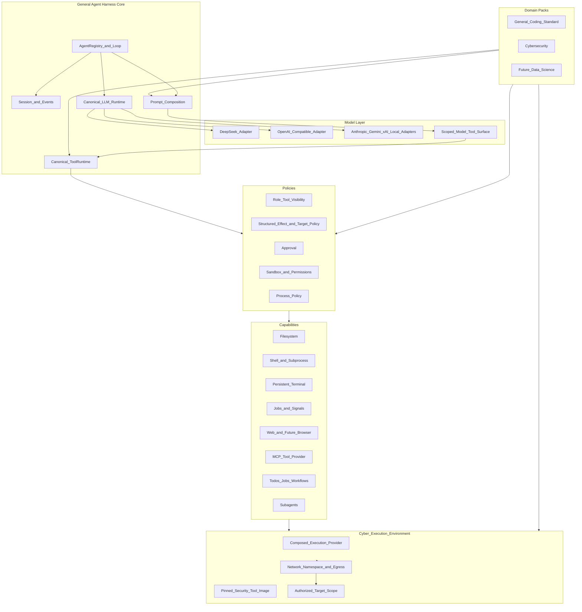

# General Agent Harness Roadmap

Status: planning only
Audit date: 2026-09-14
Revised: 2026-09-14 — Cybersecurity execution model; per-phase
reference-implementation inspection
Audited upstream: `deepseek-ai/deepseek-harness` `master` at
`c291e7961a515f6d7af9304e7fd1d257929aef26`
Reference only: `Glyph-Software/sentinel` `main` at
`9f41e394b6b7af22462d03a96181fca515075d76`

This document is the authoritative implementation roadmap for evolving
DeepSeek Harness into a domain-agnostic agent harness with Cybersecurity as the
first reference domain. It records an architectural audit and a sequence of
gated implementation phases. It does not implement those phases.

The 2026-09-14 revision changes Cybersecurity from a restricted
structured-tool proof into an execution-capable domain. Execution-oriented
roles operate real shell, persistent PTY, and installed security CLI tools
under controlled runtime boundaries. Security is not achieved by removing
agent capability. Implementation of each phase must inspect live DeepSeek
Harness seams and may compare Sentinel only as a read-only architectural
reference (Section 2.4).

All DeepSeek Harness source paths below were verified against the pinned
upstream commit. They will become local paths after Phase 0 imports the
upstream history.

## 1. Executive summary

DeepSeek Harness is already substantially more general than its name suggests.
Its Cordis composition model, scoped services, typed tool pipeline, canonical
LLM vocabulary, provider adapters, prompt assembly, session event log,
capability providers, agent presets, MCP bridge, subagents, jobs, workflows,
and persistent terminals provide most of the requested architecture.

The correct approach is not to build a second framework. The minimum
architectural delta is:

1. Preserve the complete upstream history and establish a merge-based upstream
   synchronization workflow.
2. Let independently installed packages contribute agent-preset roots through
   a reversible `AgentPresets` extension.
3. Add a scoped model-tool-surface view to the existing `ToolRuntime`, with
   identity behavior by default.
4. Add host-only effect descriptors to existing typed tools and enforce them
   through an opt-in policy plugin built on `tools/pre-execute`, approval, and
   monotonic guards.
5. Add an isolated Cybersecurity domain bundle with role-specific presets,
   prompts, skills, and policy. Execution-oriented roles expose the existing
   generic Bash, persistent Bash/PTY, and jobs capabilities, plus at least
   one real security CLI binary inside a composed Cyber Execution
   Environment. Structured security tools complement shell; they do not
   replace it.
6. Enforce engagement scope at execution-provider and network boundaries for
   arbitrary shell, and with typed effect/target policy for structured
   tools. Do not treat command-string parsing as the security boundary.
7. Keep the shipped `standard` preset unchanged as the general/coding control.

There is no justified `REPLACE` operation in the first increment.

## 2. Audit scope and evidence

### 2.1 Local repository state

At audit time this repository contained one commit and only `README.md`.
DeepSeek Harness source was not present locally. The architecture was therefore
audited read-only from the linked upstream repository at the exact commit above.

The selected repository migration strategy is a full-history merge, not a
snapshot or submodule. That operation belongs to Phase 0 and must not be mixed
with the planning commit.

### 2.2 Licenses and safety posture

- DeepSeek Harness is MIT licensed.
- Its
  [SAFETY.md](https://github.com/deepseek-ai/deepseek-harness/blob/c291e7961a515f6d7af9304e7fd1d257929aef26/SAFETY.md)
  states that it is experimental, has not undergone a security audit, and must
  not be treated as the sole security boundary for untrusted workloads.
- Sentinel has no repository `LICENSE`, no SPDX metadata, and no package-level
  license grant at the audited commit. Default copyright therefore applies.
  This project may study its architecture but must not copy its source,
  prompts, schemas, or other protected expression without a later explicit
  license grant.

### 2.3 Audit method

The audit traced:

- application/profile boot;
- agent creation, turns, steps, cancellation, and concurrency;
- model selection, adapter resolution, and provider wire conversion;
- prompt and runtime-context assembly;
- tool registration, validation, policy, execution, and result persistence;
- sessions, events, projections, and SDK delivery;
- filesystem, subprocess, shell, sandbox, terminal, Web, and code-runtime
  capabilities;
- bundles, profiles, presets, persona, scopes, and plugin disposal;
- MCP tool import;
- jobs, goals, todos, workflows, and subagents;
- approval and monotonic guard behavior;
- shipped tests and documented safety limitations.

No runtime test was executed during the remote audit because the source was not
yet present in this repository.

The planning audit is not a substitute for per-phase re-inspection. Before
implementing a phase, inspect the current DeepSeek Harness source at the
imported or pinned revision. Do not design from this document’s memory of
upstream seams.

### 2.4 Reference implementations

DeepSeek Harness is the authoritative implementation base.

- After Phase 0, prefer the locally imported upstream source.
- When validating upstream behavior or changes, compare against the
  pinned/documented upstream revision recorded at the top of this document,
  or a later imported revision recorded in the upstream-sync note.
- Extend established DeepSeek seams. Do not introduce a parallel
  abstraction because a phase was designed from memory or from this plan
  alone.

`Glyph-Software/sentinel` is a read-only architectural reference only. Use it
where relevant, especially for:

- shell and Bash agent interaction;
- persistent/interactive terminal behavior;
- sandboxed execution;
- approval and permission UX;
- task/subagent coordination;
- monitoring/background execution;
- security-oriented agent workflows.

Do not copy Sentinel source code, prompts, schemas, or other protected
expression. Architectural similarity must come from independent design
against DeepSeek seams.

For every phase, before introducing a new abstraction or landing
implementation, record:

1. which existing DeepSeek seams were inspected, with package/path and
   revision;
2. what those seams already provide;
3. whether Sentinel was relevant and, if so, which architectural pattern was
   compared;
4. why `REUSE` or `EXTEND` is insufficient if a `NEW` or `REPLACE` operation
   is proposed.

The record belongs in the phase architecture/agent note or
`docs/notes/phase-<n>-reference-inspection.md`. A phase that adds a new
abstraction without this record does not meet its exit criteria.

## 3. Current architecture assessment

### 3.1 Composition and plugin kernel

DeepSeek Harness is a Cordis application whose operating principle is
"Everything is a Plugin." Services are exposed on a shared `Context`, behavior
is contributed through typed events and waterfalls, and registrations unwind
through effects.

The main composition mechanisms are:

- host/application profiles loaded by
  [`packages/boot/app-boot/src/profile.ts`](../../packages/boot/app-boot/src/profile.ts);
- ordered bundle patches such as
  [`packages/bundle/base/cordis.patch.yml`](../../packages/bundle/base/cordis.patch.yml);
- loader isolation and interception;
- agent-scoped services from
  [`packages/core/scope/src/index.ts`](../../packages/core/scope/src/index.ts);
- per-agent preset compositions from
  [`packages/preset/agent-presets/src/index.ts`](../../packages/preset/agent-presets/src/index.ts).

Profiles are host application compositions such as `web`, `headless`, `sdk`,
`sdk-minimal`, and `acp`. An agent preset is the correct existing unit for a
role/persona/capability composition. These terms must not be conflated.

### 3.2 Runtime spine

The existing runtime spine is:

- `ctx.sessions`:
  [`packages/core/session`](../../packages/core/session);
- `ctx.systemPrompt`:
  [`packages/core/system-prompt`](../../packages/core/system-prompt);
- `ctx.tools`:
  [`packages/core/tools`](../../packages/core/tools);
- `ctx.agents`:
  [`packages/core/agent`](../../packages/core/agent);
- `ctx.agentLoop`:
  [`packages/core/agent-loop`](../../packages/core/agent-loop);
- `ctx.llm`:
  [`packages/llm/llm`](../../packages/llm/llm).

These are plugins, not a monolithic immutable core.

### 3.3 End-to-end agent request lifecycle

```mermaid
sequenceDiagram
  participant Client as CLI_Web_SDK
  participant Agent as AgentRegistry
  participant Loop as ReactLoopAgent
  participant Prompt as SystemPrompt
  participant Session as SessionLog
  participant LLM as LlmRuntime
  participant Tools as ToolRuntime
  participant Provider as CapabilityProvider

  Client->>Agent: send_or_followup
  Agent->>Loop: durable_inbox_splice_and_wake
  Loop->>Loop: turn_start_and_claim_inbox
  Loop->>Prompt: assemble_scoped_sections_context_tools
  Loop->>Loop: agent_pre_step
  Loop->>Loop: agent_request_waterfall
  Loop->>LLM: prepareCall
  Loop->>Session: system_user_request_header_context
  Session-->>Loop: deriveMessages
  Loop->>LLM: stream_frozen_request
  LLM-->>Loop: assistant_and_tool_call_chunks
  Loop->>Session: tool_call
  Loop->>Tools: prepare_and_dispatch
  Tools->>Tools: pre_execute_approval_guards
  Tools->>Provider: typed_execution
  Provider-->>Tools: canonical_result
  Tools->>Tools: post_execute_and_finalize
  Tools-->>Loop: normalized_result
  Loop->>Session: tool_result
  Loop->>Loop: next_step_or_turn_end
```

The implementation is primarily in
[`packages/core/agent-loop/src/agent.ts`](../../packages/core/agent-loop/src/agent.ts)
and
[`packages/core/agent-loop/src/tool-calls.ts`](../../packages/core/agent-loop/src/tool-calls.ts).

Important existing guarantees:

- a step is one model request and its tool calls;
- a turn is one or more steps;
- inbox mutations are durable;
- accepted system/user context is committed only after call preparation
  succeeds;
- cancellation uses caller-owned abort signals;
- undispatched tool calls receive synthetic aborted results;
- explicitly concurrency-safe tools may run in a bounded pool;
- exclusive tools remain ordering barriers;
- results are committed in model order.

The loop has rich event seams (`agent/pre-step`, `agent/request`,
`agent/request-error`, `agent/turn-stopping`) and should not be modified for
domain behavior.

### 3.4 Session and event architecture

[`packages/core/session/src/index.ts`](../../packages/core/session/src/index.ts)
owns an append-only `SessionEvent` log.
[`packages/core/session/src/surface.ts`](../../packages/core/session/src/surface.ts)
folds message-producing events into model history.

There are three relevant event domains:

1. Durable session events, including system, user, assistant, tool call, tool
   result, request header, and request context.
2. Live agent events for lifecycle and streaming.
3. Capability events such as `tools/*`, `fs/*`, and `llm/stream`.

The central invariant is that model-visible history is logged. New
model-visible facts require a session event and surface rule. Non-model-visible
audit events may be durable without entering the model surface.

Persistence already supports versioned JSONL generations, migration packages,
surface replacement for compaction, projections, and SDK/client mirroring.
Existing sessions must remain readable.

### 3.5 Model-provider abstraction and resolution

[`packages/llm/llm/src/types.ts`](../../packages/llm/llm/src/types.ts) defines
provider-neutral `Message`, `ContentBlock`, `StreamChunk`, `GenerateOptions`,
`ToolSchema`, and `LlmCallConfig` types.

[`packages/llm/llm/src/index.ts`](../../packages/llm/llm/src/index.ts) provides:

- adapter registration by provider;
- model resolution and listing;
- `prepareCall` and one-shot prepared calls;
- an `llm/stream` waterfall;
- canonical error/abort finish chunks;
- file/image projection when an adapter lacks a capability.

Provider conversion is correctly isolated:

- DeepSeek conversion:
  [`packages/llm/llm-deepseek/src/serialize.ts`](../../packages/llm/llm-deepseek/src/serialize.ts);
- OpenAI-compatible, Anthropic, and related catalog conversion:
  [`packages/llm/llm-pi-ai/src/context.ts`](../../packages/llm/llm-pi-ai/src/context.ts).

Model defaults are DeepSeek-first but are supplied through bundle configuration
and model-selection plugins. This is a configurable product default, not a
reason to replace the canonical model layer.

### 3.6 Prompt assembly

[`packages/core/system-prompt/src/index.ts`](../../packages/core/system-prompt/src/index.ts)
already composes:

- ordered prompt sections;
- runtime contexts;
- variables;
- global and scoped tool providers;
- a final `system-prompt/assemble` waterfall.

The agent loop assembles this for each step and uses runtime-context projection
for contextual user messages. Existing context packages independently own
workspace instructions, file references, session references, time, and tmux
context.

Required ownership maps directly to existing seams:

- core behavior: base prompt sections;
- runtime/environment: context providers;
- domain instructions: domain preset sections;
- role instructions: preset persona/role sections;
- workspace/project instructions: agent-instructions plugin;
- tool guidance: tool-owned prompt sections/schemas;
- policy/scope: effect-policy context section.

No domain prompt belongs in the agent loop.

### 3.7 Dynamic tool registry and execution pipeline

[`packages/core/tools/src/schema.ts`](../../packages/core/tools/src/schema.ts)
provides a typed authoring DSL that compiles to supported JSON Schema.
[`packages/core/tools/src/index.ts`](../../packages/core/tools/src/index.ts)
provides the scoped registry and guarded pipeline.

A registered `ToolDefinition` already carries:

- name, description, and parameter schema;
- canonical output schema and rendering;
- validated execution;
- optional cooperative timeout;
- cancellation through `exec.signal`;
- optional concurrency classifier;
- final content transformation;
- call/result presentation.

Only name, description, and parameters reach the model. Host callbacks,
timeouts, output contracts, concurrency metadata, and presentation behavior do
not.

The verified execution order is:

1. snapshot and freeze arguments;
2. enforce PTC direct-call collapse;
3. run `tools/pre-execute`;
4. route `ask` through `ctx.approval`;
5. run monotonic tool guards;
6. run the `tools/execute` around-dispatch waterfall;
7. execute and validate the tool body;
8. run `tools/post-execute`;
9. finalize model-facing content;
10. emit the canonical `tools/result`;
11. append the durable session result.

Timeouts are declarative on tools and enforced by the separate timeout-policy
plugin. This separation should remain.

MCP tools are dynamically adapted into the same registry by
[`packages/mcp/mcp-client`](../../packages/mcp/mcp-client); MCP is already a
provider of tools rather than the architecture.

### 3.8 Capabilities and providers

The requested capability/provider split already exists:

- filesystem: `ctx.fs`, with local, sandbox, and E2B providers;
- subprocess: `ctx.subprocess`, with local and E2B providers;
- one-shot shell: `ctx.shell`, with local/sandboxed Bash and PowerShell
  providers;
- sandbox: `ctx.sandbox` and `ctx.sandboxPolicy`;
- persistent terminal: `ctx.terminals`;
- Web search/fetch: `ctx.web`;
- programmatic tool runtime: `ctx.codeRuntime`;
- jobs: `ctx.jobs`;
- subagents: `ctx.subagents`;
- workflows: `ctx.workflowEngine`.

Consumers should continue depending on service definitions, not concrete
providers.

The subprocess seam uses explicit argv, scrubs credential-like parent
environment variables, supports bounded collection/spill, and exposes terminal
spawn support. Domain tools must consume these seams rather than create new
process-launch paths.

Cybersecurity must reuse this stack. Do not create a second shell framework,
a Cyber-specific Bash replacement, or a parallel PTY abstraction unless a
verified missing capability requires an additive extension.

### 3.9 Filesystem, shell, and sandbox

Filesystem tools already support typed read/write/edit operations. Mutations
pass filesystem intent waterfalls and can use observation-before-write policy.

Sandbox modes include `read-only`, `workspace-write`, and
`danger-full-access`, with fail-closed behavior when the selected sandbox is
unavailable.

The critical limitation is that the local sandbox controls filesystem effects,
not network egress or all syscalls. It cannot independently enforce a
cybersecurity engagement target allowlist for arbitrary Bash or PTY commands.
Prompts, approvals, and command-string parsing do not close that gap.

That limitation is an execution-provider problem, not a reason to hide Bash
or PTY from execution-oriented Cybersecurity roles. The first increment
reuses the existing shell, subprocess, sandbox, terminal, and jobs
capabilities. Stronger network namespace, destination, DNS, and egress
controls are an explicit staged track (Section 8.5 and Phase 6). Do not
claim those guarantees before a provider enforces them. Do not block shell
functionality while they are developed. Development and test profiles may
operate only against explicitly authorized local lab targets.

### 3.10 Persistent terminal

[`packages/terminal/terminal/src/types.ts`](../../packages/terminal/terminal/src/types.ts)
already defines a first-class persistent PTY abstraction:

- `spawn`;
- `startSend` for write/submit plus asynchronous waiting;
- incremental operation output;
- retained scrollback reads;
- foreground process-group signals;
- status;
- idempotent close.

Backends are selected by a stable type. Sessions are fenced to the exact owning
agent and one send is active per session. The Bash terminal provider consumes
the sandbox/subprocess stack.

Missing capabilities are terminal resize and restart durability. They are not
required for the first Cybersecurity implementation if the existing PTY
already supports spawn, write, incremental output, follow-up input, signals,
and close. Resize should later be an additive backend method; durability
requires a separate design because live PTY processes cannot be reconstructed
from the session transcript.

Execution-oriented Cybersecurity roles must use this existing persistent
terminal architecture for interactive security workflows. Typical interaction:

```text
start terminal
  → write command
  → receive partial output
  → wait/read more
  → write follow-up input
  → send signal if required
  → continue
```

That covers tools that take a long time, stream continuously, prompt for
input, need interruption, or maintain process/session state. Do not defer
interactive PTY itself. Do not replace `ctx.terminals` to obtain this
behavior.

### 3.11 Tasks, jobs, workflows, and subagents

The repository does not have one stable generic `TaskRegistry`, but it already
has the pieces needed by this increment:

- todo/plan/goal state;
- `ctx.jobs` with local providers and model tools;
- `ctx.workflowEngine` with a worker-thread provider;
- `ctx.subagents` with named, replaceable providers;
- experimental agent-team task DAGs.

Subagents have a provider interface and scoped tool restrictions. In-process
children can inherit the exact standing preset generation through
`AgentPresets.composeFrom`.

The experimental task DAG must not be promoted into core merely to match
Sentinel terminology. The first increment should reuse todo/goal/jobs and
subagents.

### 3.12 Policy and approval

Current controls include:

- name-based scoped tool restrictions;
- pre-execute allow/deny/ask decisions;
- one-shot approval;
- monotonic deny-only tool guards;
- filesystem intent policy;
- sandbox escalation approval;
- timeout policy;
- permission presets that compose sandbox and approval settings.

The monotonic guard is an important safety guarantee: later listeners cannot
turn a guard denial into an allow.

Current limitations:

- tools have no first-class generic effect taxonomy;
- approval requests do not include structured arguments;
- approval grants are one-shot;
- there is no generic target/CIDR/path policy;
- arbitrary shell content is too expressive for reliable target extraction,
  so command-string parsing must not be treated as engagement-scope
  enforcement;
- same-process plugins remain trusted code.

Structured tools can still declare typed effects and targets before
execution. Arbitrary Bash/PTY must instead be constrained by process policy
and the isolated execution provider, including network-level enforcement as
that provider matures.

### 3.13 Profiles, bundles, presets, and roles

Profiles layer bundle patches and a profile-local patch. Bundles are npm
packages declaring `dsh.bundle.patch`. Agent presets are discovered from
configured roots, mounted once per generation, and joined through agent scopes.

The preset ID already functions as a dynamic role ID. `preset.yml` supplies
display metadata, persona supplies role identity, and `agent.cordis.yml`
supplies prompt sections, skills, tools, and scoped services. A separate
`RoleRegistry` would duplicate this lifecycle.

One missing composition seam is package contribution of preset roots.
`AgentPresets` derives a fixed list from its constructor configuration.
Multiple independently installed domain bundles would otherwise have to
replace the same `roots` configuration. Phase 1 addresses this with a
reversible registration.

## 4. Reusable existing components

The following are `REUSE` decisions:

- Cordis context, services, effects, isolation, interception, and loader;
- profile and bundle loading;
- agent presets, persona, skills, and scoped composition;
- agent registry/factory and React loop;
- inbox, cancellation, turn/step events, and concurrency;
- append-only sessions, surface derivation, projections, compaction, and
  persistence;
- canonical LLM messages, streams, calls, and tool schemas;
- DeepSeek and pi-ai provider adapters;
- typed tool DSL, dynamic registry, PTC, validation, presentation, and result
  pipeline;
- pre-execute policy, approval, guards, timeout wrapper, and sandbox
  escalation;
- filesystem, subprocess, shell, sandbox, terminal, Web, and code-runtime
  capabilities, including generic Bash, persistent Bash/PTY, and jobs reused
  by Cybersecurity rather than replaced;
- MCP tool import;
- jobs, todos, goals, workflows, and subagents;
- the `standard` preset as general/coding behavior.

Reusing these is both the smallest change and the best upstream-maintenance
strategy.

## 5. Current limitations relative to the goal

1. This repository has not yet imported the upstream source/history.
2. Installable packages cannot reversibly contribute preset roots without
   replacing roster configuration.
3. Tool presentation supports native/PTC modality but not a generic
   model-vocabulary projection with safe reverse resolution.
4. Tool definitions do not declare generic effects or structured targets.
5. Current approval/guard configuration cannot express reusable target-aware
   domain policy without tool-name-specific listeners.
6. The local sandbox does not enforce network egress boundaries. Filesystem
   sandboxing is not network isolation.
7. Arbitrary shell and terminal commands cannot be proven inside an
   engagement target scope by parsing command strings. Pipelines, interpreters,
   curl, proxychains, environment variables, DNS, scripts, subprocesses,
   redirections, and nested shells can all hide destinations. Scope
   enforcement for arbitrary execution must occur at the execution-provider
   and network boundary, not by inferring every target from the command
   string. This is not a reason to disable Bash or PTY.
8. There is not yet a composed Cyber Execution Environment: pinned security
   binaries, container/sandbox identity, network namespace, destination
   allowlist, DNS/egress policy, and audit correlation of that environment.
   Existing shell, subprocess, sandbox, terminal, and jobs services are the
   composition surface.
9. Persistent terminals lack resize and restart durability. The existing PTY
   is sufficient for the first Cybersecurity implementation.
10. The Web seam supplies search/fetch, not browser automation.
11. Agent-team dependency tasks remain experimental.
12. DeepSeek-first model defaults and branding exist, although adapters and
    configuration are already provider-neutral.
13. Public APIs are pre-stable, increasing upstream merge and migration risk.

## 6. Target architecture



The core must not import or branch on Cybersecurity, Coding, Pentesting, or
Data Science.

### 6.1 Cybersecurity execution model

Do not solve security by removing agent capability. The intended posture is
high agent capability plus strong execution boundaries, not weak agent
capability because policy cannot understand a command.

The intended autonomous tool-use loop is:

```text
LLM
  → Bash / Persistent Bash / PTY
  → real CLI security tools
  → stdout / stderr / interactive output
  → LLM
  → reason / replan
  → next command
```

Conceptually:

```text
Model
  → Bash / Persistent PTY
  → ToolRuntime
  → Execution Policy
  → Cyber Sandbox / Container
  → Network / Egress Enforcement
  → Authorized Target Scope
```

The model should be free to use the tools available inside the authorized
environment. The environment determines what it can actually reach or modify.

Bash, persistent Bash, and persistent terminal remain generic Harness
capabilities. Cybersecurity configures:

- which roles can see them;
- which execution provider they use;
- what sandbox is attached;
- what network scope is allowed;
- what tools are installed in the environment;
- what approval and policy rules apply.

The same Bash infrastructure is reused by Coding, Data Science, DevOps,
Cybersecurity, and future domains. Do not create a Cyber-specific Bash
replacement.

The model must not be restricted to only pre-defined structured security
tools. Structured tools are valuable and remain first-class, but they
complement Bash/PTY rather than replace them.

CLI through Bash is best for tool flexibility, new tools, complex pipelines,
interactive workflows, and commands not yet wrapped:

```text
Bash → nmap
Bash → nuclei
Bash → ffuf
Bash → httpx
Bash → subfinder
Bash → nikto
Bash → curl
Bash → openssl
Bash → searchsploit
```

Structured tools are best for repeatable workflows, strong typed targets,
machine-readable results, auditing, policy, UI, and automation. Examples
include `NmapScan`, `HttpProbe`, and `VulnerabilityScan`. Do not require
wrapping every security binary before the model can use it. The minimum
requirement is that tools installed in the Cyber execution environment can
be invoked through Bash or persistent PTY:

```text
LLM
  → Bash("nmap ...")
  → sandbox/container
  → real nmap binary
  → stdout
  → LLM
```

Tool availability is role-specific, not globally disabled for the
Cybersecurity domain. Execution-oriented roles may expose Bash, persistent
Bash, persistent terminal/PTY, jobs/background execution, and
signals/interruption. Read-only roles must not receive execution
capabilities unless explicitly required.

Privilege escalation remains controlled. Allowing Bash does not mean
automatic unrestricted host access. Maintain explicit controls around
sandbox escalation, host filesystem access, credentials, privileged
containers, Docker socket access, host networking, root capabilities, and
external write effects. The model may request escalation through the
existing approval mechanism where applicable. Denial remains authoritative.
Do not introduce bypass paths around existing approval or monotonic guards.

Every shell or security execution continues through one path:

```text
model tool call
  → ToolRuntime
  → policy / approval / guards
  → shell / terminal capability
  → subprocess / sandbox provider
  → process
  → result
```

Never introduce `os.system(modelOutput)` or direct child-process creation
inside a Cyber domain tool that bypasses the capability/provider layer.

## 7. Proposed package, plugin, and profile boundaries

### 7.1 Domain pack contract

A domain pack is an ordinary installable bundle/plugin that:

- registers one package-owned preset root;
- ships one or more `agent.cordis.yml` presets;
- optionally contributes domain-owned typed tools and skills;
- composes existing generic policy and capability services;
- may include a bundle patch for host-plane dependencies;
- does not create a second loader, registry, loop, or session store.

The runtime object remains the existing preset and Cordis service graph. There
is intentionally no `DomainRegistry`.

### 7.2 Dynamic roles

A role is an agent preset:

- preset directory name: stable role ID;
- `preset.yml`: display name/description/order;
- persona and prompt sections: role instructions;
- `agent.cordis.yml`: tools, skills, restrictions, policy, and service
  requirements;
- model-selection plugin/config: optional model preference;
- workflow/subagent tool visibility: optional orchestration preference.

There is intentionally no `RoleRegistry`.

### 7.3 General/coding

The shipped
[`packages/preset/agent-presets/presets/standard`](../../packages/preset/agent-presets/presets/standard)
is the general/coding control. It must not be duplicated, renamed, or changed
merely to label it a domain.

### 7.4 Cybersecurity package

The first reference package is planned as:

```text
packages/domain/cybersecurity/
  package.json
  cordis.patch.yml
  README.md
  src/
    index.ts
    http-probe.ts
  presets/
    cybersecurity-recon/
      preset.yml
      agent.cordis.yml
      skills/
    cybersecurity-analysis/
      preset.yml
      agent.cordis.yml
      skills/
    cybersecurity-reporting/
      preset.yml
      agent.cordis.yml
      skills/
  environments/
    security-tools.manifest.yml
  tests/
```

The package name should follow the existing convention:
`@deepseek-ai/dsh-domain-cybersecurity`, unless project ownership requires a
different npm scope during implementation.

The package is isolated from core. It must not implement a private shell,
PTY, or process-launch path. It registers role presets, optional structured
tools, policy/approval configuration, and the Cyber Execution Environment
composition described in Section 8.5.

If it grows beyond one cohesive reference domain, tools, environment
manifests, and policy configuration can later be extracted into additional
domain packages.

Initial role design is not uniform:

- `cybersecurity-recon`: execution-enabled. Potential capabilities: Bash,
  persistent Bash/PTY, jobs, read/search, structured network tools, and
  subagents.
- `cybersecurity-analysis`: primarily evidence analysis, with optionally
  constrained execution.
- `cybersecurity-reporting`: read-only unless explicitly justified. No
  execution required by default.

Do not assume every Cyber role gets identical permissions. Tool availability
is role-specific.

The environment manifest records which security binaries are required, their
version pins where appropriate, and how readiness is checked. It is not a
new core abstraction. The binaries themselves live in the execution image or
sandbox, not as a catalog of mandatory structured adapters.

### 7.5 Generic policy package

Effect enforcement belongs under the existing guard subsystem:

```text
packages/guard/tool-effect-policy/
  src/
    index.ts
    types.ts
    matcher.ts
    session.ts
  tests/
  README.md
```

It remains opt-in and is mounted by domain presets or deployment profiles
that require structured effect/target policy, not by the base bundle
initially. Execution-capable Cybersecurity roles may mount it for structured
tools without using it as a command-string parser for Bash.

### 7.6 Host profile versus domain preset

- `web`, `headless`, and `sdk` remain host/application profiles.
- `standard`, `cybersecurity-recon`, `cybersecurity-analysis`, and
  `cybersecurity-reporting` are per-agent domain/role presets.
- A custom `cybersecurity` host profile may layer base + Web + domain bundle
  and select a cyber default, but it does not introduce a new runtime concept.

## 8. Proposed new contracts

These signatures are architectural contracts; exact naming should be confirmed
against the imported source before implementation.

### 8.1 Reversible preset-root contribution

```ts
interface PresetRootContribution {
  path: string
  trust: 'system' | 'user'
}

interface AgentPresets {
  registerRoot(root: PresetRootContribution): () => void
}
```

Ordering must be deterministic:

1. shipped root;
2. deployment-configured roots;
3. package-contributed roots in registration/profile-bundle order;
4. user-authored root.

First root wins duplicate IDs. Disposal removes the root from future
discoveries; agents already joined to a standing generation keep their current
composition until normal teardown.

### 8.2 Model tool surface

```ts
interface ModelToolSurfaceProjection {
  exposedName: string
  description?: string
}

interface ModelToolSurface {
  readonly id: string
  project(schema: Readonly<ToolSchema>): ModelToolSurfaceProjection | undefined
}
```

`ToolRuntime` owns the forward and reverse maps so prompt projection,
concurrency classification, policy, and execution cannot diverge.

Rules:

- the default surface is identity;
- parameters are preserved exactly;
- exposed names are unique;
- hidden tools cannot resolve;
- policy and tool bodies receive canonical names;
- the model-requested name remains available for audit;
- argument rewriting is prohibited;
- incompatible argument vocabularies require explicit typed adapter tools.

This is an `EXTEND` operation on the existing registry, not a second registry.

### 8.3 Tool effects

```ts
interface ToolEffect {
  readonly kind: string
  readonly target?: JsonValue
}

type ToolEffectResolver =
  (args: unknown) => readonly ToolEffect[]

interface ToolDefinition {
  readonly effects?: readonly ToolEffect[] | ToolEffectResolver
}
```

`defineTool` should expose a typed resolver using its existing argument schema
and validation. Resolved effects must be frozen on the execution before
pre-execute policy. Effects are host-only and never enter model tool schemas.

Initial generic vocabulary:

- `filesystem.read`;
- `filesystem.write`;
- `filesystem.delete`;
- `process.execute`;
- `process.interactive`;
- `network.connect`;
- `network.scan`;
- `external.read`;
- `external.write`;
- `credentials.use`;
- `agent.delegate`;
- `sandbox.escalate`;
- `tool.opaque`.

The vocabulary describes effects, not domains.

### 8.4 Effect policy

The policy evaluator receives:

- canonical and requested tool names;
- immutable validated/snapshotted arguments;
- resolved effect descriptors and targets;
- agent/preset scope;
- policy-configured domain and role labels;
- execution/sandbox environment facts;
- call and root-call IDs.

It returns the existing `allow`, `deny`, or `ask` decision.

Hard denials are also registered as `ctx.tools.guard()` checks, preserving the
monotonic invariant. An allow can never override another guard.

Every decision is recorded as a non-model-visible `policy/evaluated` session
event correlated by call ID. Sensitive values must be redacted before
persistence.

Structured tools and arbitrary shell do not share the same target-enforcement
mechanism. See Section 8.6.

### 8.5 Cyber Execution Environment

The Cyber Execution Environment is an architectural composition, not a new
core abstraction by default. Prefer existing sandbox, subprocess, shell,
terminal, and jobs services.

Conceptually:

```text
Cyber Agent
  → Shell / Terminal tool
  → Cyber Execution Provider
  → OCI container / sandbox
  → security tool image
```

The composed provider should eventually support:

- pinned security binaries;
- filesystem isolation;
- network policy;
- resource limits;
- environment scrubbing;
- process lifecycle;
- PTY support;
- stdout/stderr streaming;
- background jobs;
- signal handling;
- audit correlation.

Investigate how much of this already exists upstream before proposing new
code. The audited Harness already provides:

- model-facing Bash and `ctx.shell`;
- sandboxed shell providers;
- persistent terminal support and model-facing persistent Bash;
- subprocess abstraction with explicit argv and environment scrubbing;
- jobs and background processes;
- cancellation and timeouts;
- sandbox policies;
- the canonical tool execution pipeline.

Reuse them. Do not create another shell framework.

A dedicated Cyber execution-provider type is justified only if composition
cannot express a pinned security-tool image, network namespace or destination
allowlist, DNS/egress policy, or environment identity in audit records. If a
new provider is required, it still implements the existing subprocess, shell,
and terminal service contracts.

Binary lifecycle for the first implementation:

1. Install representative security CLI tools into the execution image or
   sandbox via a version-pinned manifest.
2. Check readiness: binary exists, is executable, is on PATH, and reports an
   expected version where pinning applies.
3. Expose those binaries to the generic shell/PTY environment.
4. Execute them only through the existing subprocess/sandbox stack.
5. Fail closed if a mandatory binary is missing. Do not fake tool output.

Representative tools the environment should eventually support include
`nmap`, `nuclei`, `httpx`, `subfinder`, `ffuf`, `nikto`, `curl`, `openssl`,
`searchsploit`, and other authorized security tools. The first increment
does not need a dedicated structured adapter for each tool. It does need at
least one real CLI security binary executable through Bash or persistent
PTY.

Isolation is staged and must not be over-claimed:

- Stage A, required for Phase 4: local or container-controlled execution
  against explicitly authorized lab targets. This proves functional
  capability.
- Stage B, Phase 6: network namespace plus destination controls.
- Stage C, later: stronger DNS and egress enforcement. A production-grade
  egress proxy may remain deferred.

Do not claim production-grade network isolation until provider enforcement
proves it. Do not block shell functionality completely while those
guarantees are developed.

### 8.6 Two enforcement paths

Keep this conclusion: arbitrary shell strings cannot be reliably parsed to
determine all possible network targets. Commands can use shell pipelines,
Python, curl, proxychains, environment variables, DNS, scripts, subprocesses,
redirections, and nested shells.

Do not use this sequence as the security boundary:

```text
parse arbitrary Bash
  → attempt to infer every target
  → allow / deny
```

Document two enforcement paths. Both still pass through the canonical
`ToolRuntime`.

Structured tool path:

```text
tool args
  → typed effects
  → target policy
  → provider
```

Example: `NmapScan(target="10.10.10.5")` can declare `network.scan` with
`target=10.10.10.5` and be rejected before execution.

General shell path:

```text
command
  → process policy
  → isolated execution provider
  → network-level enforcement
```

Example: `Bash(command="...")` must not pretend that command parsing provides
equivalent guarantees. A command may request any target. Only authorized
destinations should be reachable from the runtime.

The Cyber Execution Provider conceptually owns:

```text
Cyber Execution Provider
  ├── filesystem isolation
  ├── process isolation
  ├── network namespace
  ├── egress control
  ├── target allowlist
  ├── DNS policy
  └── resource limits
```

Process policy for Bash/PTY may include timeouts, cancellation, resource
limits, sandbox mode, approval for escalation, and role-scoped tool
visibility. It does not include a general command-string target extractor.

### 8.7 Evidence capture

Real shell execution must feed the Harness evidence and audit model from the
beginning. Executions retain at least:

- agent;
- tool call id;
- command;
- execution environment;
- timestamp;
- exit status;
- stdout;
- stderr;
- timeout/cancellation state;
- sandbox state;
- policy/approval decision.

Reuse existing session events, tool results, and policy audit records where
they already capture these facts. Add host-only fields only where the current
result/audit shape cannot identify the execution environment or sandbox
state.

Cyber-specific structured evidence extraction may happen later. Raw execution
provenance must exist from the beginning. Do not make evidence parsing block
the shell execution capability.

## 9. Change classification

The required preference order is:

`REUSE → EXTEND → EXTRACT → NEW → REPLACE`

### REUSE

- all runtime, session, provider, prompt, capability, profile, bundle, preset,
  MCP, subagent, jobs, workflow, and typed-tool foundations listed above;
- persistent terminal except resize/durability;
- `standard` for general/coding.

### EXTEND

- `AgentPresets` reversible roots;
- `ToolRuntime` scoped model surface;
- `ToolDefinition` host-only effects;
- existing policy pipeline with an effect-policy plugin;
- session events with policy audit records and raw shell/PTY provenance;
- existing sandbox, subprocess, shell, and terminal providers as needed to
  compose the Cyber Execution Environment and later Stage B/C network
  controls.

### EXTRACT

No extraction is required in the first increment. Extract only after the
Cybersecurity package contains a demonstrably reusable provider-neutral unit.

### NEW

- domain-pack convention and documentation;
- opt-in generic tool-effect-policy plugin;
- isolated Cybersecurity reference package and role-specific presets;
- Cyber Execution Environment composition over existing sandbox, subprocess,
  shell, terminal, and jobs services;
- representative real security-CLI execution through generic Bash/PTY;
- optional structured security tools that complement shell.

A dedicated execution-provider type is `NEW` only if investigation shows
existing providers cannot compose the required image, isolation, or audit
identity. Prefer `EXTEND` of current sandbox/subprocess providers.

### REPLACE

None. A future replacement requires an ADR showing why a Cordis extension
cannot work and must include migration and regression coverage.

### DEFER

See Section 15.

## 10. Migration strategy

1. Import the pinned upstream history with a merge commit.
2. Record a baseline before custom source changes.
3. Land generic seams independently, each with identity/permissive defaults.
4. Keep the `standard` preset and shipped profiles unchanged.
5. Add the Cybersecurity package only after generic seams are verified.
6. Add a custom profile fixture that opts into the domain bundle.
7. Verify profile unload returns the roster and behavior to baseline.
8. Preserve old sessions and SDK wire behavior; add migrations only if a
   serialized existing shape changes.
9. Do not document deferred privileged capabilities as if they were enabled.
   Execution-capable Cybersecurity roles may expose generic Bash, persistent
   PTY, and installed security CLIs. Do not claim production-grade network
   isolation before a provider enforces it.

## 11. Ordered implementation phases

Each phase is blocked on its objective exit criteria.

Before implementing a phase, inspect the relevant existing DeepSeek Harness
implementation and extend its established seams. After Phase 0, inspect the
local import. Compare behavior against the pinned/documented upstream
revision. Consult Sentinel only as a read-only architectural reference where
the phase list below marks it relevant. Record the inspection as specified
in Section 2.4. Do not start coding from this roadmap’s summaries alone.

### Phase 0 — Upstream foundation

Classification: `REUSE`

Goal:

Merge full DeepSeek Harness history into this repository at the audited commit
and establish the `upstream` synchronization workflow.

Why it is needed:

The local repository has no Harness source. A copied snapshot would discard
ancestry and make future upstream updates materially harder.

Existing code involved:

The complete upstream Git history and source tree.

Reference inspection:

- DeepSeek: repository URL, pinned `master` commit, MIT license, lockfile,
  workflow/config files, README, and SAFETY.md before merge.
- Sentinel: not required. Do not import or vendor Sentinel.
- Record the imported commit in the upstream-sync note. That revision becomes
  the local source of truth for later phases.

Exact architectural seam:

No runtime seam; this is repository lineage.

Files/packages likely affected:

- repository-wide upstream import;
- root `README.md`;
- an upstream-sync note under `docs/`.

New contracts:

None.

Migration strategy:

- add the verified upstream remote;
- fetch the specific `master` commit;
- merge unrelated histories on the required feature branch;
- use the upstream README and retain this project’s intent in project docs;
- record the source commit and merge procedure.

Backward compatibility impact:

No intended product behavior change.

Security implications:

- verify repository URL, commit, and MIT license;
- preserve the upstream lockfile;
- inspect imported workflow/config files;
- ensure no credentials enter Git history.

Tests required:

- install with upstream-required Node and pnpm versions;
- baseline typecheck and unit suite;
- config dump;
- one shipped profile smoke test;
- record any pre-existing failure without mixing a fix into this phase.

Exit criteria:

- full ancestry is visible;
- dependency install is reproducible;
- baseline results are recorded;
- the Phase 0 inspection record names the imported DeepSeek revision;
- no custom runtime change is included.

### Phase 1 — Installable domain composition

Classification: `EXTEND` + `REUSE`

Goal:

Formalize a domain pack as a bundle/plugin plus preset roots and role presets,
while retaining `standard` as general/coding.

Why it is needed:

Constructor-only roots force independently installed packages to replace the
same roster config, which does not compose.

Existing code involved:

- [`packages/preset/agent-presets/src/index.ts`](../../packages/preset/agent-presets/src/index.ts);
- [`packages/preset/agent-presets/src/discovery.ts`](../../packages/preset/agent-presets/src/discovery.ts);
- preset mount, standing generations, and scope-parent binding;
- profile/bundle loader.

Reference inspection:

- DeepSeek: `packages/preset/agent-presets` (`index.ts`, `discovery.ts`,
  mount, standing generations, `composeFrom`), profile/bundle loader, and
  shipped `standard` preset lifecycle.
- Sentinel: optional comparison of role/persona composition as architecture
  only. Do not add a `RoleRegistry` or `DomainRegistry` because Sentinel
  names those concepts.
- Record inspected preset/discovery seams before adding `registerRoot`.

Exact architectural seam:

Add reversible root registration to the existing `AgentPresets` service.
Discovery remains unmemoized and mounts remain unchanged.

Files/packages likely affected:

- agent-presets source, types, tests, and README;
- adjacent architecture/agent decision note;
- loader-real test fixtures.

New contracts:

`AgentPresets.registerRoot(root): disposer`, with the ordering and lifecycle in
Section 8.1.

Migration strategy:

Keep `config.roots`, shipped roots, and user roots working unchanged. Domain
packages use the new method.

Backward compatibility impact:

Additive. Existing roster and remote shapes remain unchanged.

Security implications:

- root trust is explicit;
- package-contributed roots are trusted same-process plugin code;
- mount leak checks and rollback remain mandatory;
- preset IDs remain path-contained.

Tests required:

- deterministic ordering and duplicate handling;
- registration disposal;
- hot list/resolve discovery;
- broken preset behavior;
- standing-generation behavior after disposal;
- mount rollback and no root-realm service leaks;
- child `composeFrom`;
- untouched profile isolation.

Exit criteria:

Two independent fixture plugins contribute roles concurrently, unload cleanly,
and do not alter a profile that did not load them. The inspection record lists
the DeepSeek preset/discovery seams that were re-read before the extension.

### Phase 2 — Model Tool Surface

Classification: `EXTEND`

Goal:

Separate canonical executable tools from model-facing names/descriptions
without a second registry.

Why it is needed:

Current native/PTC modes select representation style but do not support
model-specific vocabulary. Prompt-only aliasing would reach
`UNKNOWN_TOOL` before policy.

Existing code involved:

- ToolRuntime scoped layers;
- `wireSchemas`, `schemas`, `resolveExecution`, and `executionMode`;
- request-header tool snapshots;
- PTC mode;
- provider adapters.

Reference inspection:

- DeepSeek: `packages/core/tools` ToolRuntime scoped layers, `wireSchemas`,
  `schemas`, `resolveExecution`, `executionMode`, PTC, request-header tool
  snapshots, and DeepSeek/pi-ai adapter serialization.
- Sentinel: optional comparison of model-facing tool vocabulary. Do not
  create a second tool registry or rewrite arguments to match a Sentinel
  schema.
- Record inspected ToolRuntime seams before adding `ModelToolSurface`.

Exact architectural seam:

Add one reversible scoped surface to `ctx.tools`. ToolRuntime owns projection
and reverse resolution.

Files/packages likely affected:

- [`packages/core/tools/src/index.ts`](../../packages/core/tools/src/index.ts);
- tool types/tests/README;
- optional small preset plugin that selects a surface;
- architecture decision note.

New contracts:

The `ModelToolSurface` contract in Section 8.2 and an optional requested/exposed
name on immutable execution/audit data.

Migration strategy:

Identity is the default. Existing tools, providers, PTC, restrictions, and
profiles require no configuration change.

Backward compatibility impact:

Identity mode must be snapshot-identical. Existing `ToolExecution.name`
semantics remain canonical.

Security implications:

- duplicate aliases fail closed;
- alias maps are scoped and immutable during one request;
- hidden/restricted tools cannot resolve by aliases;
- parameters and executed arguments are unchanged;
- canonical name drives policy and concurrency.

Tests required:

- identity parity;
- projection and reverse resolution;
- duplicate/collision rejection;
- hidden and restricted tools;
- PTC/native/both combinations;
- concurrency classification;
- cancellation;
- request-header replay;
- DeepSeek and OpenAI-compatible serialization.

Exit criteria:

A scripted model calls a synthetic exposed alias, one canonical tool executes
through the normal pipeline, identity snapshots remain unchanged, and the
inspection record lists the ToolRuntime/adapter seams that were re-read.

### Phase 3 — Effect-aware scoped policy

Classification: `EXTEND` + `NEW`

Goal:

Add generic effect descriptors and target-aware allow/deny/ask decisions
without weakening existing policy.

Why it is needed:

Name-only restrictions cannot express network, credential, delegation,
interactive process, or target scope. Structured tools can declare typed
targets. Shell and PTY tools declare process effects. Command-string parsing
is not a substitute for either, and must not be used to hide Bash from
execution-capable roles.

Existing code involved:

- `defineTool` and `ToolDefinition`;
- immutable tool execution;
- pre-execute, approval, and guard stages;
- timeout and sandbox policy;
- sessions and projections.

Reference inspection:

- DeepSeek: `defineTool` / `ToolDefinition`, immutable tool execution,
  `tools/pre-execute`, `ctx.approval`, `ctx.tools.guard()`, timeout-policy,
  sandbox escalation, and session/projection event types.
- Sentinel: approval and permission UX as architecture only. Adapt onto
  existing one-shot approval and monotonic guards. Do not copy Sentinel
  permission schemas or prompts.
- Record inspected policy/approval/guard seams before adding effect
  descriptors or a new policy plugin.

Exact architectural seam:

Add a host-only effect resolver to existing tool definitions, then mount an
opt-in policy plugin that uses pre-execute for ask/soft decisions and
`ctx.tools.guard()` for hard denials.

Files/packages likely affected:

- core tools types/schema/tests;
- [`packages/guard/tool-effect-policy`](../../packages/guard/tool-effect-policy);
- first-party annotations for tools used by effect-aware profiles, including
  `process.execute` / `process.interactive` on generic shell and terminal
  tools without parsing command strings into network targets;
- session event types and SDK snapshots;
- pipeline/policy documentation.

New contracts:

The `ToolEffect` and policy contracts in Section 8.

Migration strategy:

- legacy tools remain valid;
- profiles that do not mount the policy remain unchanged;
- effect-aware profiles classify undeclared tools as `tool.opaque`;
- annotate first-party tools incrementally;
- generic Bash and terminal tools declare process effects, not parsed
  network targets.

Backward compatibility impact:

- model schemas exclude effects;
- adapters are untouched;
- old profiles stay permissive/unchanged;
- old sessions continue to load;
- new audit events do not enter model history.

Security implications:

- effects resolve after argument snapshot/validation and before approval;
- malformed or unknown structured targets fail closed in effect-aware mode;
- Bash/PTY are not denied merely because a command string cannot be parsed
  into a complete target list;
- deny always wins;
- no policy rewrites arguments;
- no command-string parser is treated as scope enforcement;
- audit records are redacted and correlated by call ID.

Tests required:

- typed resolver validation;
- metadata non-leakage;
- allow/deny/ask and deny precedence;
- missing policy and opaque tools;
- path, hostname, IP, and CIDR matching for structured tools;
- shell/PTY tools are not scoped by command-string target extraction;
- DNS-rebinding assumptions;
- sandbox environment conditions;
- timeout/cancel races;
- nested PTC dispatch;
- MCP opaque defaults;
- session replay and SDK compatibility.

Exit criteria:

An out-of-scope structured-tool call is denied before provider invocation.
A shell/PTY call is not denied merely because targets cannot be parsed from
the command string. An in-scope approved call executes exactly once, every
decision is auditable, standard-profile snapshots are unchanged, and the
inspection record lists the DeepSeek policy/approval/guard seams that were
re-read.

### Phase 4 — Cybersecurity execution-capable domain

Classification: `NEW` + `REUSE`

Goal:

Prove a real Cybersecurity execution loop: an execution-enabled role uses
generic Bash or persistent Bash/PTY to run a real security CLI binary in a
controlled environment, the model receives real stdout/stderr, and the model
makes a subsequent tool decision. Preserve general/coding behavior.

This phase is not merely one structured `cyber_http_probe`. Structured tools
remain useful and may be included, but they complement the shell path.

Why it is needed:

The Cybersecurity domain must support autonomous tool use against real CLI
security tools. A structured-only proof would understate the product goal and
would solve security by removing capability.

Existing code involved:

- bundles and package plugins;
- registered preset roots;
- persona/system-prompt/skills;
- generic Bash, persistent Bash, `ctx.shell`, `ctx.subprocess`, `ctx.terminals`,
  `ctx.jobs`, cancellation, timeouts, and sandbox policy;
- typed tools and optional `ctx.web`;
- filesystem, todos/jobs, and subagents;
- restrictions, approval, and effect policy.

Reference inspection:

- DeepSeek: model-facing Bash and `ctx.shell`; sandboxed shell providers;
  `ctx.subprocess`; `ctx.sandbox` / `ctx.sandboxPolicy`; `ctx.terminals`
  persistent PTY (`spawn`, `startSend`, incremental output, signals, close);
  model-facing persistent Bash; `ctx.jobs`; cancellation/timeouts; tool
  execution pipeline; environment scrubbing. Re-read these before composing
  the Cyber Execution Environment.
- Sentinel: compare architectural patterns for shell/Bash agent interaction,
  persistent/interactive terminal behavior, sandboxed execution,
  monitoring/background execution, task/subagent coordination, and
  security-oriented agent workflows. Do not copy Sentinel tools, prompts,
  schemas, or scanner wrappers. Do not replace DeepSeek Bash/PTY with a
  Sentinel-like private shell.
- Record inspected DeepSeek execution seams and any Sentinel pattern
  comparison before adding environment composition, role presets, or a new
  provider type.

Exact architectural seam:

Add `@deepseek-ai/dsh-domain-cybersecurity` as a normal bundle/plugin. It
registers its package-owned preset root, role-specific tool visibility, and a
composed Cyber Execution Environment over existing generic services. It does
not add a second shell or PTY framework.

Files/packages likely affected:

- [`packages/domain/cybersecurity`](../../packages/domain/cybersecurity);
- custom profile fixture/example;
- execution-environment manifest and readiness checks;
- optional `EXTEND` of an existing sandbox/subprocess provider if image
  composition cannot be expressed by configuration alone;
- domain documentation and tests.

New contracts:

No required new core contract. The package adds:

- `cybersecurity-recon` execution-enabled role preset with Bash, persistent
  Bash/PTY, jobs, read/search, optional structured network tools, and
  subagents;
- `cybersecurity-analysis` evidence-analysis role with optionally constrained
  execution;
- `cybersecurity-reporting` read-only role unless explicitly justified;
- a composed Stage A Cyber Execution Environment: local or container
  controlled execution, pinned representative security binaries, readiness
  checks, filesystem/process isolation already provided by the sandbox, and
  authorized local lab target scope;
- at least one real security CLI binary (for example `nmap` or an equivalent
  authorized tool) invoked through generic Bash or persistent PTY;
- optional structured tools such as `cyber_http_probe` / `NmapScan` that
  declare typed effects and targets;
- raw execution provenance into the existing audit/session model.

Migration strategy:

Install the bundle into a custom profile or add it to an existing Web profile.
Only the custom cyber profile selects a cyber default. Development and test
profiles operate only against explicitly authorized local lab targets. Stage B
and C network isolation is not required to start this phase.

Backward compatibility impact:

The package is opt-in. Loading/unloading it changes only its preset roster,
agent scopes, and attached execution environment. `standard` remains
unchanged. Generic Bash/PTY remain available to non-cyber roles according to
their existing presets.

Security implications:

- engagement scope for structured tools is machine-enforced typed policy, not
  prompt text;
- engagement scope for arbitrary shell is the execution provider and network
  boundary, not command-string parsing;
- Stage A may only reach authorized local/lab destinations; do not claim
  production-grade egress control yet;
- execution-capable roles may expose Bash, persistent PTY, jobs, signals, and
  approved security binaries;
- reporting remains read-only by default;
- analysis remains constrained unless a later decision expands it;
- credentials, privileged containers, Docker socket access, host networking,
  root capabilities, host filesystem escape, and sandbox escalation remain
  controlled by existing approval and monotonic guards;
- child agents inherit the exact parent preset/policy generation;
- unavailable mandatory enforcement for a chosen profile fails closed;
- Stage A lab profiles must not mark Stage B/C network isolation as
  mandatory; doing so would fail closed and block required shell capability;
- missing mandatory binaries fail closed; output is never faked.

Tests required:

- prompt section ownership and order;
- role discovery/mount/disposal;
- role-specific tool visibility: recon has Bash/PTY/jobs; reporting does not
  unless justified; analysis is more constrained than recon by default;
- readiness check for at least one real security CLI binary;
- end-to-end loop against a safe authorized local test target:

  ```text
  Cyber agent
    → real Bash / persistent Bash
    → real security binary in controlled environment
    → real command output
    → LLM receives result
    → LLM makes a second tool decision
  ```

- real stdout/stderr reach the model; do not stub the binary's output;
- persistent terminal interaction: write, partial output, follow-up input,
  and signal/interrupt where the existing PTY supports it;
- timeout, cancellation, and job/background behavior through the normal
  provider path;
- no domain-local `os.system` or raw child-process bypass;
- raw execution provenance (command, environment, exit status, stdout/stderr,
  timeout/cancel, sandbox state, policy/approval);
- structured-tool target denial still occurs before provider invocation;
- subagent inheritance;
- profile isolation;
- no `standard` snapshot change.

Exit criteria:

- an execution-enabled Cybersecurity role can call the real Bash tool;
- persistent Bash/PTY is available to an appropriate cyber role;
- at least one real security CLI binary executes through the normal
  provider path;
- real stdout/stderr reach the model;
- the model can choose a subsequent action based on that output;
- no direct process-launch bypass exists outside the capability/provider
  architecture;
- execution remains auditable;
- standard/general agents remain unaffected;
- read-only cyber roles remain appropriately restricted;
- unloading Cybersecurity restores the original roster;
- the inspection record lists the DeepSeek shell/PTY/sandbox/jobs seams that
  were re-read and, if Sentinel was consulted, which patterns were compared
  without source reuse.

Distinguish functional capability, which this phase must prove, from
production-grade network isolation, which this phase must not claim.

### Phase 5 — Cross-layer verification and compatibility

Classification: `REUSE` + `EXTEND`

Goal:

Verify the complete minimum increment through real loader composition,
provider adapters, sessions, SDKs, and sandbox boundaries.

Why it is needed:

Package-unit tests alone cannot prove lifecycle and isolation guarantees.

Existing code involved:

- Vitest and coverage;
- real-loader fixtures;
- snapshot harness;
- SDK server/client;
- session persistence;
- DeepSeek and pi-ai adapters;
- Web/headless profile fixtures.

Reference inspection:

- DeepSeek: Vitest/coverage layout, real-loader fixtures, snapshot harness,
  SDK server/client, session persistence/replay, and adapter test suites.
  Re-read these before adding new golden data or fixtures.
- Sentinel: not required unless a verification scenario is compared
  architecturally. Do not import Sentinel tests, prompts, or schemas.
- Record which DeepSeek test/SDK seams were inspected before changing
  snapshots or adding compatibility gates.

Exact architectural seam:

Use existing test tiers and a scripted fake LLM adapter for deterministic
end-to-end calls.

Files/packages likely affected:

- adjacent package tests;
- profile fixtures;
- explicit new snapshots;
- SDK tests;
- architecture and subsystem docs.

New contracts:

None beyond Phases 1–4. Phase 6 network-isolation work is a separate track
and must not be treated as already proven here.

Migration strategy:

Keep all new fixtures opt-in. Update golden data only when a new surface,
policy, or domain is explicitly selected.

Backward compatibility impact:

Compare standard prompt, schemas, config dump, session replay, CLI behavior,
and SDK wire events with the Phase 0 baseline.

Security implications:

Adversarial coverage must include:

- symlink/path escape;
- hostname/IP/CIDR ambiguity;
- DNS rebinding assumptions;
- MCP opaque classification;
- nested dispatch;
- cancellation races;
- denied provider invocation for structured out-of-scope targets;
- environment scrubbing;
- subagent/profile isolation;
- no domain-local process-launch bypass;
- read-only cyber roles cannot reach Bash/PTY;
- documentation does not claim Stage B/C network isolation.

Tests required:

- unit and coverage;
- typecheck and lint;
- integration:
  `LLM → Bash/PTY or structured tool → policy → provider → real result → next LLM step`;
- sandbox/process tests;
- profile isolation;
- DeepSeek and OpenAI-compatible adapter tests;
- TypeScript and Python SDK regressions;
- snapshots and docs sync;
- no `standard` behavior change.

Exit criteria:

All gates pass or an unchanged upstream baseline failure is explicitly
quarantined. No provider-specific or Cybersecurity-specific dependency enters
core contracts. Functional Cybersecurity execution is verified. Production-grade
network isolation is not claimed. The inspection record lists the DeepSeek
test, SDK, and adapter seams that were re-read.

### Phase 6 — Cyber execution-provider network isolation

Classification: `EXTEND` + possible `NEW` provider

Goal:

Promote execution-provider and network isolation from vague deferred work into
an explicit staged implementation track. Strengthen destination control around
the already enabled shell/PTY path without replacing that path.

Why it is needed:

Filesystem sandboxing alone is not network isolation. Arbitrary processes can
open connections that structured target policy never saw. Command-string
parsing cannot close that gap. The model may already use Bash; the runtime
must eventually make unauthorized destinations unreachable.

Existing code involved:

- `ctx.sandbox`, `ctx.sandboxPolicy`, `ctx.subprocess`, `ctx.shell`,
  `ctx.terminals`;
- existing local and E2B sandbox providers;
- environment scrubbing and resource limits;
- effect policy for structured tools;
- Cyber Execution Environment composition from Phase 4.

Reference inspection:

- DeepSeek: `ctx.sandbox`, `ctx.sandboxPolicy`, local and E2B sandbox
  providers, `ctx.subprocess`, `ctx.shell`, `ctx.terminals`, environment
  scrubbing, and resource limits. A new provider type is allowed only if this
  inspection shows those contracts cannot express namespace, destination, or
  DNS/egress controls.
- Sentinel: sandboxed execution and security-oriented isolation as
  architecture only. Do not copy Sentinel sandbox/network implementations.
- Record inspected DeepSeek sandbox/subprocess seams and the Sentinel
  comparison, if any, before adding a new execution-provider abstraction.

Exact architectural seam:

Prefer extending an existing sandbox/subprocess provider with network
namespace, destination allowlist, and later DNS/egress controls. Add a new
provider type only if those services cannot express the required isolation
while still implementing the existing capability contracts.

Staged delivery:

- Stage B: network namespace plus destination controls for the Cyber
  Execution Environment. Unauthorized destinations should be unreachable even
  if a command names them.
- Stage C: stronger DNS and egress enforcement. A production-grade egress
  proxy and DNS pinning may remain deferred if Stage B already provides a
  real destination boundary.

Files/packages likely affected:

- sandbox/subprocess provider packages;
- Cyber Execution Environment composition;
- policy/audit fields for network/sandbox identity;
- isolation tests and documentation of remaining limitations.

New contracts:

Only if investigation proves a new provider interface is required. Otherwise
extend existing sandbox/subprocess contracts with network-scope configuration
and audit identity.

Migration strategy:

Keep Stage A local/lab execution working. Enable Stage B/C per deployment
profile. Fail closed when a profile requires mandatory network enforcement
that is unavailable. Do not silently fall back to host networking.

Backward compatibility impact:

`standard` and other non-cyber execution providers remain unchanged unless
they opt into the same network controls. Existing structured-tool target
policy remains in place.

Security implications:

- do not claim guarantees before they exist;
- do not treat command parsing as equivalent to destination unreachability;
- privileged host networking, Docker socket access, and unrestricted egress
  remain denied by default;
- denial and fail-closed behavior stay authoritative;
- audit must record which isolation stage was actually in force.

Tests required:

- authorized local/lab destination remains reachable;
- unauthorized destination is unreachable from Bash and PTY, not merely
  denied by a parser;
- structured-tool target policy still denies before invocation;
- fail-closed when mandatory enforcement is unavailable;
- `standard` profile isolation;
- no bypass around approval or monotonic guards.

Exit criteria:

Stage B proves destination unreachability from arbitrary shell in the Cyber
Execution Environment. Documentation states the remaining Stage C gaps
explicitly. Functional shell capability from Phase 4 remains intact. The
inspection record lists the DeepSeek sandbox/subprocess/shell/terminal seams
that were re-read and justifies any new provider type from that inspection.

## 12. Test strategy

### 12.1 Unit

- preset root registration, ordering, and disposal;
- model surface identity, aliases, hiding, and collisions;
- tool effect declarations and typed resolvers;
- policy decisions and monotonic guard composition;
- target matching;
- prompt section composition;
- role/preset registration;
- domain profile composition;
- existing terminal capability reused, not replaced;
- shell/PTY role visibility;
- security-binary readiness checks.

### 12.2 Integration

Use a scripted canonical LLM adapter to produce deterministic tool calls.

Structured path:

```text
LLM
  → exposed tool schema
  → tool call
  → canonical surface resolution
  → effect/scope policy
  → capability provider
  → structured tool result
  → session event
  → next LLM request
```

General shell path:

```text
LLM
  → Bash / persistent Bash / PTY
  → process policy / approval / guards
  → Cyber Execution Provider
  → real security CLI binary
  → stdout / stderr / interactive output
  → session event and raw provenance
  → next LLM request
```

Assert both model-visible history and non-model-visible audit records. Do not
fake CLI output.

### 12.3 Sandbox and process

Verify that domain tools cannot bypass:

- workspace/path boundaries;
- process-launch seams;
- network target policy for structured tools;
- credential scrubbing;
- scope restrictions;
- cancellation/timeout quiescence;
- role-scoped Bash/PTY visibility.

Do not claim arbitrary shell network isolation until a provider enforces it.
Phase 4 tests prove functional execution against authorized lab targets.
Phase 6 tests prove destination unreachability.

### 12.4 Profile isolation

- load standard without Cybersecurity and capture baseline;
- load Cybersecurity and verify only its roster/scopes change;
- create standard and cyber agents concurrently;
- unload Cybersecurity;
- verify standard behavior and global registry are unchanged.

### 12.5 Provider compatibility

- canonical schema to DeepSeek wire format;
- canonical schema to OpenAI-compatible/pi-ai format;
- identity surface parity;
- aliased surface provider independence;
- provider errors and cancellation normalized through existing stream types.

### 12.6 Regression tiers

Use the upstream project’s supported commands after Phase 0 confirms them:

- unit suite;
- coverage suite;
- typecheck;
- lint;
- snapshot suite;
- real-loader/profile tests;
- SDK tests;
- optional real-provider E2E only when credentials are available.

## 13. Security model

### 13.1 Enforcement order

```mermaid
flowchart TD
  model[Model_Decision] --> call[Durable_Tool_Call]
  call --> resolve[Canonical_Surface_Resolution]
  resolve --> runtime[Canonical_ToolRuntime]

  runtime --> structured[Structured_Tool_Path]
  structured --> effects[Typed_Effects_and_Targets]
  effects --> scope[Target_Policy]
  scope --> approvalS[Approval_when_required]
  approvalS --> guardS[Monotonic_Guards]
  guardS --> providerS[Capability_Provider]

  runtime --> shell[General_Shell_Path]
  shell --> process[Process_Policy]
  process --> approvalB[Approval_when_required]
  approvalB --> guardB[Monotonic_Guards]
  guardB --> exec[Isolated_Execution_Provider]
  exec --> net[Network_Level_Enforcement]

  providerS --> result[Result_and_Evidence]
  net --> result
  result --> audit[Session_and_Policy_Audit]
  audit --> model
```

Prompts advise. Policy and providers enforce. Structured target policy and
network-level enforcement are complementary, not interchangeable.

### 13.2 Trust boundaries

- Cordis scopes are composition boundaries, not untrusted-code sandboxes.
- Agent presets from system/package roots are trusted code.
- User presets carry shell-equivalent trust.
- MCP servers and their tools are external trust boundaries.
- Tool output and monitored content are untrusted data, not instructions.
- Local filesystem sandboxing is not network isolation.

### 13.3 Cybersecurity defaults

Execution-capable Cybersecurity roles may expose Bash, persistent PTY, and
approved security binaries. Security boundaries are enforced through
role-scoped tool visibility, ToolRuntime policy, sandboxing, execution
providers, network/egress controls, authorization scope, approvals, and
audit. Read-only Cybersecurity roles should not receive execution
capabilities unless required.

Defaults:

- deny undeclared/opaque tools in effect-aware cyber roles;
- structured tools allow only typed targets in configured engagement scope;
- arbitrary shell is not scoped by parsing the command string;
- use bounded timeout/cancellation and retain raw execution provenance;
- credentials, privileged containers, Docker socket access, host networking,
  root capabilities, and host filesystem escape remain off by default and
  require existing approval if ever requested;
- arbitrary security MCP servers remain off by default;
- fail closed when a profile's mandatory enforcement is unavailable;
- Stage A lab profiles must not mark Stage B/C isolation as mandatory;
  profiles that require Stage B/C fail closed if that enforcement is
  unavailable;
- redact secrets from audit and model content;
- preserve one execution path through the typed tool pipeline.

There must never be an `os.system(modelOutput)` or equivalent path.

Do not keep arbitrary shell, PTY, or scanners off merely because policy cannot
parse the command. Stage A lab-scoped execution is allowed before Stage B/C
network isolation exists, provided the limitation is documented and test
targets are explicitly authorized.

### 13.4 Audit

The durable audit consists of:

- request header and exposed tool schemas;
- model-requested tool name and arguments;
- canonical tool identity;
- policy effects, targets, decision, policy ID, and reason;
- approval outcome;
- command, execution environment, and sandbox state for shell/PTY;
- stdout, stderr, and exit status for process execution;
- normalized tool result/evidence;
- cancellation/timeout outcome.

Raw provenance is required from the first Cybersecurity implementation.
Structured cyber evidence extraction may be added later and must not block
shell execution.

## 14. Backward compatibility strategy

Preserve by default:

- shipped profiles and bundle order;
- `standard`, `ptc`, `minimal`, and `cordis` presets;
- current plugins and Cordis effects;
- provider adapters and model selection;
- tool schemas, PTC, and execution contracts;
- session reading/replay;
- TypeScript/Python SDK interfaces;
- MCP registration and naming;
- CLI commands and config dumps.

Compatibility mechanisms:

- additive methods and optional fields;
- identity model surface;
- opt-in effect policy;
- opt-in domain bundle;
- no domain metadata in core request types;
- no existing file moves/renames;
- adjacent regression coverage;
- explicit migration if a serialized shape must change.

If a breaking change becomes unavoidable:

1. document why an additive extension cannot work;
2. add an ADR;
3. define source and serialized-data migration;
4. update SDKs together;
5. add regression and replay coverage;
6. call it out before implementation.

## 15. Explicit deferred work

The first increment intentionally defers:

- Sentinel-R3 compatibility mappings until a stable public contract and
  sufficient license permission exist;
- a full scanner catalog and dedicated structured adapters for every
  security binary;
- arbitrary security MCP servers;
- credential broker/use policy enforcement;
- production-grade egress proxy;
- DNS pinning;
- terminal resize and restart durability, if the existing PTY already
  supports the Phase 4 interactive loop;
- privileged exploitation environments, including privileged containers,
  host networking, Docker socket access, and root capabilities;
- distributed execution workers;
- advanced supervisor orchestration;
- browser automation beyond Web search/fetch;
- persistent approval grants and structured approval payloads;
- a stable generic dependency-DAG task registry;
- planner/executor, graph, and supervisor agent drivers;
- Data Science domain package;
- effect-aware concurrency scheduling;
- transitive static effect closure for all possible subagent providers.

The following are not deferred. They are required for the first meaningful
Cybersecurity implementation:

- generic Bash for execution-capable Cybersecurity roles, including
  arbitrary command strings inside the authorized execution environment;
- interactive persistent PTY / persistent Bash;
- jobs, background execution, and signals/interruption;
- basic real security CLI execution through the generic shell path;
- representative nmap/httpx/nuclei-style CLI integration as an installed
  binary, without requiring a structured adapter for each tool;
- Stage A Cyber Execution Environment composition.

Stage B network namespace and destination controls are an active Phase 6
track, not an unnamed deferral. Stage C stronger DNS/egress enforcement may
proceed after Stage B; a production-grade proxy may remain deferred.

Deferred privileged capabilities stay disabled and documented. Deferred
isolation guarantees must not be implied by enabling shell. Enabling Bash
and PTY for execution-capable roles is required capability, not a partial
enablement of deferred privileged access.

## 16. Risks and architectural tradeoffs

### Upstream churn

The project is pre-stable and active. Revalidate source paths and contracts
against the exact imported commit before editing. Keep core deltas small and
adjacent to existing seams. The planning audit in this document is evidence
for sequencing, not a license to skip per-phase inspection of the live
DeepSeek source.

### Security maturity

DeepSeek Harness is unaudited. The domain package must not market the result as
a production security boundary.

### Sentinel licensing

No source license was found. Architectural similarity must come from
independent design, not source reuse. Sentinel may be compared as a
read-only reference for the patterns listed in Section 2.4. It is never an
implementation base.

### Tool surface consistency

Aliases can cause prompt/execution/policy drift. The map must therefore be
owned by ToolRuntime, scoped, collision-checked, and argument-preserving.

### Policy completeness

Structured tools can declare reliable targets. Arbitrary command strings
cannot. Parsing Bash to infer every destination is not a security boundary
and would create a false sense of scope enforcement.

The correct response is not to disable shell. Structured tools keep typed
effect/target policy. Arbitrary shell keeps process policy plus isolated
execution-provider and network-level enforcement. A conservative unknown
structured effect may still fail closed. A general shell command is not
converted into a structured target list.

### Network enforcement

A pre-execute allowlist can prevent a structured tool from being invoked with
an out-of-scope target. It cannot stop an already allowed arbitrary process
from opening another connection. Provider-level isolation is required for
that case.

Stage A may run against authorized local lab targets before that isolation
exists. Stage B must make unauthorized destinations unreachable. Do not
claim Stage B/C guarantees in Phase 4.

### Preset root lifecycle

Removing a contributed root affects future discovery, while existing agents
may retain a standing mount generation. This is consistent with current preset
file-change behavior but must be explicit and tested.

### Audit sensitivity

Arguments and outputs may contain secrets. Audit completeness must be balanced
with redaction and retention policy.

## 17. Upstream synchronization strategy

1. Keep `deepseek-ai/deepseek-harness` as the documented upstream remote.
2. Preserve full upstream history and use merge commits for updates.
3. Do not flatten upstream into copied snapshots.
4. Avoid renaming or moving upstream files.
5. Keep domain code under `packages/domain/`.
6. Keep generic policy code under the existing guard category.
7. Limit upstream-core changes to:
   - reversible preset-root registration;
   - consistent model-surface projection/resolution;
   - host-only effect metadata/execution projection.
8. Prefer composing or extending existing sandbox, subprocess, shell, and
   terminal providers for Cyber execution and network isolation. Do not add
   a parallel process-launch stack.
9. Record every core delta in the upstream project’s architecture/agent-note
   style, including the Section 2.4 reference-inspection record.
10. Keep tests adjacent to each modified upstream package.
11. Re-run baseline and isolation suites after every upstream merge.
12. Re-inspect local imported DeepSeek seams before each later phase; do not
    rely on the planning-time audit as the implementation source of truth.

## 18. Ideas already solved by DeepSeek Harness

- plugin/composition kernel;
- agent loop and lifecycle interception;
- append-only sessions/events and context derivation;
- provider-neutral model/runtime contracts;
- adapter-boundary wire conversion;
- dynamic scoped typed tool registry;
- validation, timeout, cancellation, concurrency, and presentation;
- prompt composition;
- filesystem/shell/subprocess/sandbox capability providers;
- first-class persistent terminal;
- MCP as a tool provider;
- jobs, workflows, goals/todos, and subagents;
- profiles, bundles, personas, and agent presets;
- name restrictions, approval, and monotonic guards.

These should be reused, not recreated.

## 19. Requested ideas adapted to the real repository

- "Domain Profile" becomes a domain bundle plus agent role presets. A boot
  profile remains an application composition.
- "Role Registry" is the existing `AgentPresets` registry.
- "Model Tool Surface" extends ToolRuntime; prompt-only mapping is unsafe.
- "Canonical Tool Schema" already exists and remains provider-neutral.
- "Interactive Terminal" already exists; only resize/durability are missing,
  and the existing PTY is the Cybersecurity interaction path.
- "Capability/Provider separation" already exists across filesystem, shell,
  subprocess, sandbox, terminal, Web, jobs, and subagents.
- "MCP provider" is already implemented that way.
- "Multiple orchestration strategies" remain possible through the agent factory,
  events, workflow engine, and subagent providers. No speculative driver
  abstraction is needed until a second real driver is implemented.
- "Task management" reuses todo/goal/jobs. Experimental agent-team DAGs remain
  experimental.
- Sentinel compatibility is an optional future model surface, not core
  behavior.

## 20. Definition of Done

The eventual minimum implementation is done only when:

- full upstream history is present and baseline behavior is recorded;
- general/coding `standard` and Cybersecurity compositions coexist;
- core contains no Cybersecurity-specific logic, imports, or conditionals;
- independently installed domain packages can contribute and dispose preset
  roots;
- canonical tools still serialize through DeepSeek and OpenAI-compatible
  provider boundaries;
- identity tool-surface behavior is unchanged;
- a synthetic alias proves canonical execution without argument rewriting;
- effect policy denies out-of-scope structured targets before provider
  invocation;
- policy cannot weaken restrictions, guards, approval, or sandbox behavior;
- every Cybersecurity execution decision is auditable and redacted;
- the reference package contributes at least recon, analysis, and reporting
  roles with non-identical permissions;
- an execution-enabled Cybersecurity role can call the real Bash tool;
- persistent Bash/PTY is available to an appropriate cyber role;
- at least one real security CLI binary executes through the normal
  provider path;
- its real stdout/stderr reaches the model;
- the model can choose a subsequent action based on that output;
- no direct process-launch bypass exists outside the capability/provider
  architecture;
- execution remains auditable, including command, environment, exit status,
  stdout/stderr, timeout/cancel, sandbox state, and policy/approval;
- read-only cyber roles remain appropriately restricted;
- standard/general agents remain unaffected;
- profile unload leaves general/coding behavior unchanged;
- existing CLI, SDK, session replay, MCP, subagent, cancellation, concurrency,
  and standard-profile regression suites pass;
- all required Phases 0–5 exit criteria are satisfied in order for the
  minimum functional implementation;
- Phase 6 is required before claiming production-grade network isolation, not
  before enabling shell, PTY, or real CLI execution;
- documentation accurately describes both guarantees and limitations;
- each implemented phase has a reference-inspection record naming the
  DeepSeek seams that were re-read and, when Sentinel was relevant, the
  architectural pattern compared before any new abstraction.

Functional capability is distinct from production-grade network isolation.
The minimum implementation is not complete without the shell/PTY/CLI loop.
It is complete without Stage B/C only if documentation does not claim
destination unreachability that the provider has not proven. Privileged host
access, credential brokers, and related deferred capabilities remain
disabled.

## 21. Immediate implementation order

1. Phase 0: import and baseline upstream.
2. Phase 1: reversible domain-preset root contribution.
3. Phase 2: scoped model tool surface.
4. Phase 3: effect-aware policy and audit, including separate structured and
   shell enforcement paths.
5. Phase 4: Cybersecurity execution-capable domain, Stage A environment, and
   real CLI-through-Bash proof.
6. Phase 5: full compatibility and security verification of functional
   capability.
7. Phase 6: execution-provider network isolation, Stage B then Stage C.

No later phase begins until the preceding phase meets its exit criteria.
Each phase starts with the Section 2.4 reference inspection of live DeepSeek
seams, not with new code. Phase 6 must not be used to reopen a Phase 4 design
that disables Bash or PTY.
