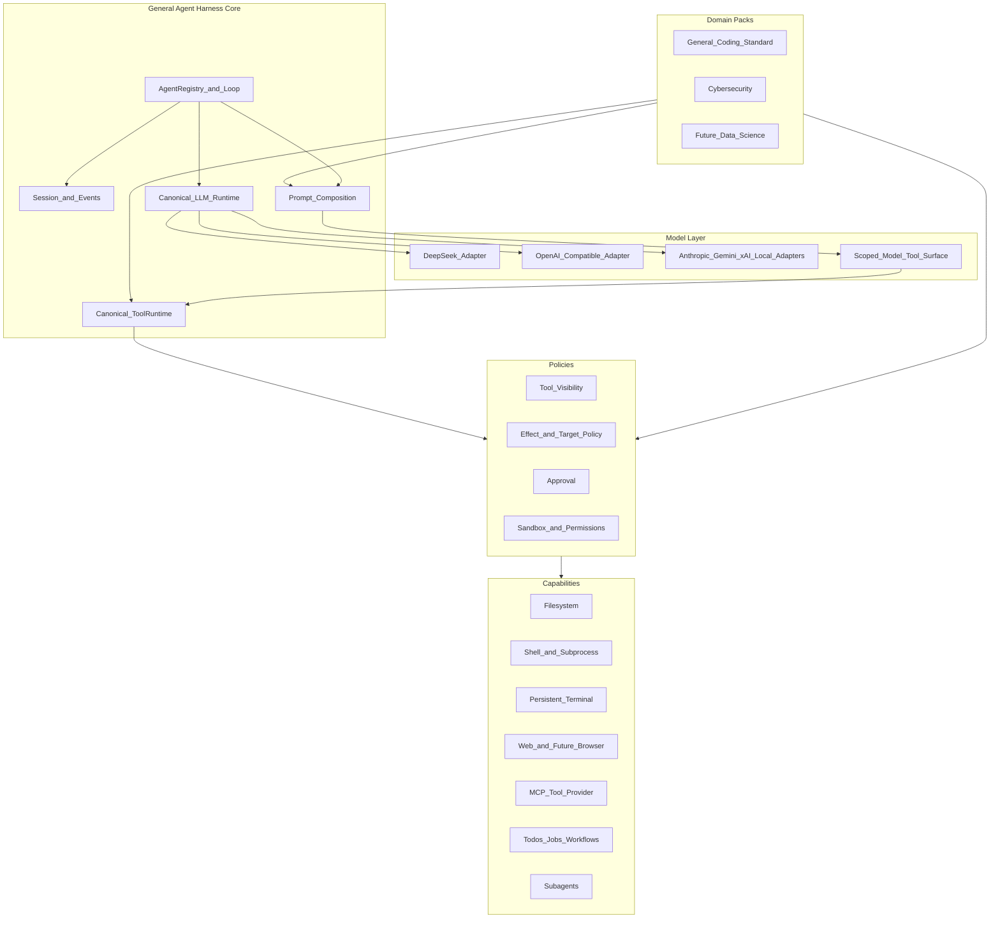

# General Agent Harness Roadmap

Status: planning only  
Audit date: 2026-09-14  
Audited upstream: `deepseek-ai/deepseek-harness` `master` at
`c291e7961a515f6d7af9304e7fd1d257929aef26`  
Reference only: `Glyph-Software/sentinel` `main` at
`9f41e394b6b7af22462d03a96181fca515075d76`

This document is the authoritative implementation roadmap for evolving
DeepSeek Harness into a domain-agnostic agent harness with Cybersecurity as the
first reference domain. It records an architectural audit and a sequence of
gated implementation phases. It does not implement those phases.

All DeepSeek Harness source paths below were verified against the pinned
upstream commit. They will become local paths after Phase 0 imports the
upstream history.

## 1. Executive summary

DeepSeek Harness is already substantially more general than its name suggests.
Its Cordis composition model, scoped services, typed tool pipeline, canonical
LLM vocabulary, provider adapters, prompt assembly, session event log,
capability providers, agent presets, MCP bridge, subagents, jobs, workflows,
and persistent terminals provide most of the requested architecture.

The correct approach is not to build a second framework. The minimum
architectural delta is:

1. Preserve the complete upstream history and establish a merge-based upstream
   synchronization workflow.
2. Let independently installed packages contribute agent-preset roots through
   a reversible `AgentPresets` extension.
3. Add a scoped model-tool-surface view to the existing `ToolRuntime`, with
   identity behavior by default.
4. Add host-only effect descriptors to existing typed tools and enforce them
   through an opt-in policy plugin built on `tools/pre-execute`, approval, and
   monotonic guards.
5. Add an isolated Cybersecurity domain bundle with role presets, prompts,
   skills, strict policy, and one structured scope-checked reference tool.
6. Keep the shipped `standard` preset unchanged as the general/coding control.

There is no justified `REPLACE` operation in the first increment.

## 2. Audit scope and evidence

### 2.1 Local repository state

At audit time this repository contained one commit and only `README.md`.
DeepSeek Harness source was not present locally. The architecture was therefore
audited read-only from the linked upstream repository at the exact commit above.

The selected repository migration strategy is a full-history merge, not a
snapshot or submodule. That operation belongs to Phase 0 and must not be mixed
with the planning commit.

### 2.2 Licenses and safety posture

- DeepSeek Harness is MIT licensed.
- Its
  [SAFETY.md](https://github.com/deepseek-ai/deepseek-harness/blob/c291e7961a515f6d7af9304e7fd1d257929aef26/SAFETY.md)
  states that it is experimental, has not undergone a security audit, and must
  not be treated as the sole security boundary for untrusted workloads.
- Sentinel has no repository `LICENSE`, no SPDX metadata, and no package-level
  license grant at the audited commit. Default copyright therefore applies.
  This project may study its architecture but must not copy its source,
  prompts, schemas, or other protected expression without a later explicit
  license grant.

### 2.3 Audit method

The audit traced:

- application/profile boot;
- agent creation, turns, steps, cancellation, and concurrency;
- model selection, adapter resolution, and provider wire conversion;
- prompt and runtime-context assembly;
- tool registration, validation, policy, execution, and result persistence;
- sessions, events, projections, and SDK delivery;
- filesystem, subprocess, shell, sandbox, terminal, Web, and code-runtime
  capabilities;
- bundles, profiles, presets, persona, scopes, and plugin disposal;
- MCP tool import;
- jobs, goals, todos, workflows, and subagents;
- approval and monotonic guard behavior;
- shipped tests and documented safety limitations.

No runtime test was executed during the remote audit because the source was not
yet present in this repository.

## 3. Current architecture assessment

### 3.1 Composition and plugin kernel

DeepSeek Harness is a Cordis application whose operating principle is
"Everything is a Plugin." Services are exposed on a shared `Context`, behavior
is contributed through typed events and waterfalls, and registrations unwind
through effects.

The main composition mechanisms are:

- host/application profiles loaded by
  [`packages/boot/app-boot/src/profile.ts`](../../packages/boot/app-boot/src/profile.ts);
- ordered bundle patches such as
  [`packages/bundle/base/cordis.patch.yml`](../../packages/bundle/base/cordis.patch.yml);
- loader isolation and interception;
- agent-scoped services from
  [`packages/core/scope/src/index.ts`](../../packages/core/scope/src/index.ts);
- per-agent preset compositions from
  [`packages/preset/agent-presets/src/index.ts`](../../packages/preset/agent-presets/src/index.ts).

Profiles are host application compositions such as `web`, `headless`, `sdk`,
`sdk-minimal`, and `acp`. An agent preset is the correct existing unit for a
role/persona/capability composition. These terms must not be conflated.

### 3.2 Runtime spine

The existing runtime spine is:

- `ctx.sessions`:
  [`packages/core/session`](../../packages/core/session);
- `ctx.systemPrompt`:
  [`packages/core/system-prompt`](../../packages/core/system-prompt);
- `ctx.tools`:
  [`packages/core/tools`](../../packages/core/tools);
- `ctx.agents`:
  [`packages/core/agent`](../../packages/core/agent);
- `ctx.agentLoop`:
  [`packages/core/agent-loop`](../../packages/core/agent-loop);
- `ctx.llm`:
  [`packages/llm/llm`](../../packages/llm/llm).

These are plugins, not a monolithic immutable core.

### 3.3 End-to-end agent request lifecycle

```mermaid
sequenceDiagram
  participant Client as CLI_Web_SDK
  participant Agent as AgentRegistry
  participant Loop as ReactLoopAgent
  participant Prompt as SystemPrompt
  participant Session as SessionLog
  participant LLM as LlmRuntime
  participant Tools as ToolRuntime
  participant Provider as CapabilityProvider

  Client->>Agent: send_or_followup
  Agent->>Loop: durable_inbox_splice_and_wake
  Loop->>Loop: turn_start_and_claim_inbox
  Loop->>Prompt: assemble_scoped_sections_context_tools
  Loop->>Loop: agent_pre_step
  Loop->>Loop: agent_request_waterfall
  Loop->>LLM: prepareCall
  Loop->>Session: system_user_request_header_context
  Session-->>Loop: deriveMessages
  Loop->>LLM: stream_frozen_request
  LLM-->>Loop: assistant_and_tool_call_chunks
  Loop->>Session: tool_call
  Loop->>Tools: prepare_and_dispatch
  Tools->>Tools: pre_execute_approval_guards
  Tools->>Provider: typed_execution
  Provider-->>Tools: canonical_result
  Tools->>Tools: post_execute_and_finalize
  Tools-->>Loop: normalized_result
  Loop->>Session: tool_result
  Loop->>Loop: next_step_or_turn_end
```

The implementation is primarily in
[`packages/core/agent-loop/src/agent.ts`](../../packages/core/agent-loop/src/agent.ts)
and
[`packages/core/agent-loop/src/tool-calls.ts`](../../packages/core/agent-loop/src/tool-calls.ts).

Important existing guarantees:

- a step is one model request and its tool calls;
- a turn is one or more steps;
- inbox mutations are durable;
- accepted system/user context is committed only after call preparation
  succeeds;
- cancellation uses caller-owned abort signals;
- undispatched tool calls receive synthetic aborted results;
- explicitly concurrency-safe tools may run in a bounded pool;
- exclusive tools remain ordering barriers;
- results are committed in model order.

The loop has rich event seams (`agent/pre-step`, `agent/request`,
`agent/request-error`, `agent/turn-stopping`) and should not be modified for
domain behavior.

### 3.4 Session and event architecture

[`packages/core/session/src/index.ts`](../../packages/core/session/src/index.ts)
owns an append-only `SessionEvent` log.
[`packages/core/session/src/surface.ts`](../../packages/core/session/src/surface.ts)
folds message-producing events into model history.

There are three relevant event domains:

1. Durable session events, including system, user, assistant, tool call, tool
   result, request header, and request context.
2. Live agent events for lifecycle and streaming.
3. Capability events such as `tools/*`, `fs/*`, and `llm/stream`.

The central invariant is that model-visible history is logged. New
model-visible facts require a session event and surface rule. Non-model-visible
audit events may be durable without entering the model surface.

Persistence already supports versioned JSONL generations, migration packages,
surface replacement for compaction, projections, and SDK/client mirroring.
Existing sessions must remain readable.

### 3.5 Model-provider abstraction and resolution

[`packages/llm/llm/src/types.ts`](../../packages/llm/llm/src/types.ts) defines
provider-neutral `Message`, `ContentBlock`, `StreamChunk`, `GenerateOptions`,
`ToolSchema`, and `LlmCallConfig` types.

[`packages/llm/llm/src/index.ts`](../../packages/llm/llm/src/index.ts) provides:

- adapter registration by provider;
- model resolution and listing;
- `prepareCall` and one-shot prepared calls;
- an `llm/stream` waterfall;
- canonical error/abort finish chunks;
- file/image projection when an adapter lacks a capability.

Provider conversion is correctly isolated:

- DeepSeek conversion:
  [`packages/llm/llm-deepseek/src/serialize.ts`](../../packages/llm/llm-deepseek/src/serialize.ts);
- OpenAI-compatible, Anthropic, and related catalog conversion:
  [`packages/llm/llm-pi-ai/src/context.ts`](../../packages/llm/llm-pi-ai/src/context.ts).

Model defaults are DeepSeek-first but are supplied through bundle configuration
and model-selection plugins. This is a configurable product default, not a
reason to replace the canonical model layer.

### 3.6 Prompt assembly

[`packages/core/system-prompt/src/index.ts`](../../packages/core/system-prompt/src/index.ts)
already composes:

- ordered prompt sections;
- runtime contexts;
- variables;
- global and scoped tool providers;
- a final `system-prompt/assemble` waterfall.

The agent loop assembles this for each step and uses runtime-context projection
for contextual user messages. Existing context packages independently own
workspace instructions, file references, session references, time, and tmux
context.

Required ownership maps directly to existing seams:

- core behavior: base prompt sections;
- runtime/environment: context providers;
- domain instructions: domain preset sections;
- role instructions: preset persona/role sections;
- workspace/project instructions: agent-instructions plugin;
- tool guidance: tool-owned prompt sections/schemas;
- policy/scope: effect-policy context section.

No domain prompt belongs in the agent loop.

### 3.7 Dynamic tool registry and execution pipeline

[`packages/core/tools/src/schema.ts`](../../packages/core/tools/src/schema.ts)
provides a typed authoring DSL that compiles to supported JSON Schema.
[`packages/core/tools/src/index.ts`](../../packages/core/tools/src/index.ts)
provides the scoped registry and guarded pipeline.

A registered `ToolDefinition` already carries:

- name, description, and parameter schema;
- canonical output schema and rendering;
- validated execution;
- optional cooperative timeout;
- cancellation through `exec.signal`;
- optional concurrency classifier;
- final content transformation;
- call/result presentation.

Only name, description, and parameters reach the model. Host callbacks,
timeouts, output contracts, concurrency metadata, and presentation behavior do
not.

The verified execution order is:

1. snapshot and freeze arguments;
2. enforce PTC direct-call collapse;
3. run `tools/pre-execute`;
4. route `ask` through `ctx.approval`;
5. run monotonic tool guards;
6. run the `tools/execute` around-dispatch waterfall;
7. execute and validate the tool body;
8. run `tools/post-execute`;
9. finalize model-facing content;
10. emit the canonical `tools/result`;
11. append the durable session result.

Timeouts are declarative on tools and enforced by the separate timeout-policy
plugin. This separation should remain.

MCP tools are dynamically adapted into the same registry by
[`packages/mcp/mcp-client`](../../packages/mcp/mcp-client); MCP is already a
provider of tools rather than the architecture.

### 3.8 Capabilities and providers

The requested capability/provider split already exists:

- filesystem: `ctx.fs`, with local, sandbox, and E2B providers;
- subprocess: `ctx.subprocess`, with local and E2B providers;
- one-shot shell: `ctx.shell`, with local/sandboxed Bash and PowerShell
  providers;
- sandbox: `ctx.sandbox` and `ctx.sandboxPolicy`;
- persistent terminal: `ctx.terminals`;
- Web search/fetch: `ctx.web`;
- programmatic tool runtime: `ctx.codeRuntime`;
- jobs: `ctx.jobs`;
- subagents: `ctx.subagents`;
- workflows: `ctx.workflowEngine`.

Consumers should continue depending on service definitions, not concrete
providers.

The subprocess seam uses explicit argv, scrubs credential-like parent
environment variables, supports bounded collection/spill, and exposes terminal
spawn support. Domain tools must consume these seams rather than create new
process-launch paths.

### 3.9 Filesystem, shell, and sandbox

Filesystem tools already support typed read/write/edit operations. Mutations
pass filesystem intent waterfalls and can use observation-before-write policy.

Sandbox modes include `read-only`, `workspace-write`, and
`danger-full-access`, with fail-closed behavior when the selected sandbox is
unavailable.

The critical limitation is that the local sandbox controls filesystem effects,
not network egress or all syscalls. It cannot independently enforce a
cybersecurity engagement target allowlist for arbitrary Bash or PTY commands.
Prompts and approvals do not close that gap.

### 3.10 Persistent terminal

[`packages/terminal/terminal/src/types.ts`](../../packages/terminal/terminal/src/types.ts)
already defines a first-class persistent PTY abstraction:

- `spawn`;
- `startSend` for write/submit plus asynchronous waiting;
- incremental operation output;
- retained scrollback reads;
- foreground process-group signals;
- status;
- idempotent close.

Backends are selected by a stable type. Sessions are fenced to the exact owning
agent and one send is active per session. The Bash terminal provider consumes
the sandbox/subprocess stack.

Missing capabilities are terminal resize and restart durability. They are not
needed to prove the first domain abstraction. Resize should later be an
additive backend method; durability requires a separate design because live
PTY processes cannot be reconstructed from the session transcript.

### 3.11 Tasks, jobs, workflows, and subagents

The repository does not have one stable generic `TaskRegistry`, but it already
has the pieces needed by this increment:

- todo/plan/goal state;
- `ctx.jobs` with local providers and model tools;
- `ctx.workflowEngine` with a worker-thread provider;
- `ctx.subagents` with named, replaceable providers;
- experimental agent-team task DAGs.

Subagents have a provider interface and scoped tool restrictions. In-process
children can inherit the exact standing preset generation through
`AgentPresets.composeFrom`.

The experimental task DAG must not be promoted into core merely to match
Sentinel terminology. The first increment should reuse todo/goal/jobs and
subagents.

### 3.12 Policy and approval

Current controls include:

- name-based scoped tool restrictions;
- pre-execute allow/deny/ask decisions;
- one-shot approval;
- monotonic deny-only tool guards;
- filesystem intent policy;
- sandbox escalation approval;
- timeout policy;
- permission presets that compose sandbox and approval settings.

The monotonic guard is an important safety guarantee: later listeners cannot
turn a guard denial into an allow.

Current limitations:

- tools have no first-class generic effect taxonomy;
- approval requests do not include structured arguments;
- approval grants are one-shot;
- there is no generic target/CIDR/path policy;
- arbitrary shell content is too expressive for reliable target extraction;
- same-process plugins remain trusted code.

### 3.13 Profiles, bundles, presets, and roles

Profiles layer bundle patches and a profile-local patch. Bundles are npm
packages declaring `dsh.bundle.patch`. Agent presets are discovered from
configured roots, mounted once per generation, and joined through agent scopes.

The preset ID already functions as a dynamic role ID. `preset.yml` supplies
display metadata, persona supplies role identity, and `agent.cordis.yml`
supplies prompt sections, skills, tools, and scoped services. A separate
`RoleRegistry` would duplicate this lifecycle.

One missing composition seam is package contribution of preset roots.
`AgentPresets` derives a fixed list from its constructor configuration.
Multiple independently installed domain bundles would otherwise have to
replace the same `roots` configuration. Phase 1 addresses this with a
reversible registration.

## 4. Reusable existing components

The following are `REUSE` decisions:

- Cordis context, services, effects, isolation, interception, and loader;
- profile and bundle loading;
- agent presets, persona, skills, and scoped composition;
- agent registry/factory and React loop;
- inbox, cancellation, turn/step events, and concurrency;
- append-only sessions, surface derivation, projections, compaction, and
  persistence;
- canonical LLM messages, streams, calls, and tool schemas;
- DeepSeek and pi-ai provider adapters;
- typed tool DSL, dynamic registry, PTC, validation, presentation, and result
  pipeline;
- pre-execute policy, approval, guards, timeout wrapper, and sandbox
  escalation;
- filesystem, subprocess, shell, sandbox, terminal, Web, and code-runtime
  capabilities;
- MCP tool import;
- jobs, todos, goals, workflows, and subagents;
- the `standard` preset as general/coding behavior.

Reusing these is both the smallest change and the best upstream-maintenance
strategy.

## 5. Current limitations relative to the goal

1. This repository has not yet imported the upstream source/history.
2. Installable packages cannot reversibly contribute preset roots without
   replacing roster configuration.
3. Tool presentation supports native/PTC modality but not a generic
   model-vocabulary projection with safe reverse resolution.
4. Tool definitions do not declare generic effects or structured targets.
5. Current approval/guard configuration cannot express reusable target-aware
   domain policy without tool-name-specific listeners.
6. The local sandbox does not enforce network egress boundaries.
7. Arbitrary shell and terminal commands cannot be proven inside an
   engagement target scope by parsing command strings.
8. Persistent terminals lack resize and restart durability.
9. The Web seam supplies search/fetch, not browser automation.
10. Agent-team dependency tasks remain experimental.
11. DeepSeek-first model defaults and branding exist, although adapters and
    configuration are already provider-neutral.
12. Public APIs are pre-stable, increasing upstream merge and migration risk.

## 6. Target architecture



The core must not import or branch on Cybersecurity, Coding, Pentesting, or
Data Science.

## 7. Proposed package, plugin, and profile boundaries

### 7.1 Domain pack contract

A domain pack is an ordinary installable bundle/plugin that:

- registers one package-owned preset root;
- ships one or more `agent.cordis.yml` presets;
- optionally contributes domain-owned typed tools and skills;
- composes existing generic policy and capability services;
- may include a bundle patch for host-plane dependencies;
- does not create a second loader, registry, loop, or session store.

The runtime object remains the existing preset and Cordis service graph. There
is intentionally no `DomainRegistry`.

### 7.2 Dynamic roles

A role is an agent preset:

- preset directory name: stable role ID;
- `preset.yml`: display name/description/order;
- persona and prompt sections: role instructions;
- `agent.cordis.yml`: tools, skills, restrictions, policy, and service
  requirements;
- model-selection plugin/config: optional model preference;
- workflow/subagent tool visibility: optional orchestration preference.

There is intentionally no `RoleRegistry`.

### 7.3 General/coding

The shipped
[`packages/preset/agent-presets/presets/standard`](../../packages/preset/agent-presets/presets/standard)
is the general/coding control. It must not be duplicated, renamed, or changed
merely to label it a domain.

### 7.4 Cybersecurity package

The first reference package is planned as:

```text
packages/domain/cybersecurity/
  package.json
  cordis.patch.yml
  README.md
  src/
    index.ts
    http-probe.ts
  presets/
    cybersecurity-recon/
      preset.yml
      agent.cordis.yml
      skills/
    cybersecurity-reporting/
      preset.yml
      agent.cordis.yml
      skills/
  tests/
```

The package name should follow the existing convention:
`@deepseek-ai/dsh-domain-cybersecurity`, unless project ownership requires a
different npm scope during implementation.

The package is isolated from core. If it grows beyond one cohesive reference
domain, tools and policy configuration can later be extracted into additional
domain packages.

### 7.5 Generic policy package

Effect enforcement belongs under the existing guard subsystem:

```text
packages/guard/tool-effect-policy/
  src/
    index.ts
    types.ts
    matcher.ts
    session.ts
  tests/
  README.md
```

It remains opt-in and is mounted by strict domain presets or deployment
profiles, not by the base bundle initially.

### 7.6 Host profile versus domain preset

- `web`, `headless`, and `sdk` remain host/application profiles.
- `standard`, `cybersecurity-recon`, and `cybersecurity-reporting` are
  per-agent domain/role presets.
- A custom `cybersecurity` host profile may layer base + Web + domain bundle
  and select a cyber default, but it does not introduce a new runtime concept.

## 8. Proposed new contracts

These signatures are architectural contracts; exact naming should be confirmed
against the imported source before implementation.

### 8.1 Reversible preset-root contribution

```ts
interface PresetRootContribution {
  path: string
  trust: 'system' | 'user'
}

interface AgentPresets {
  registerRoot(root: PresetRootContribution): () => void
}
```

Ordering must be deterministic:

1. shipped root;
2. deployment-configured roots;
3. package-contributed roots in registration/profile-bundle order;
4. user-authored root.

First root wins duplicate IDs. Disposal removes the root from future
discoveries; agents already joined to a standing generation keep their current
composition until normal teardown.

### 8.2 Model tool surface

```ts
interface ModelToolSurfaceProjection {
  exposedName: string
  description?: string
}

interface ModelToolSurface {
  readonly id: string
  project(schema: Readonly<ToolSchema>): ModelToolSurfaceProjection | undefined
}
```

`ToolRuntime` owns the forward and reverse maps so prompt projection,
concurrency classification, policy, and execution cannot diverge.

Rules:

- the default surface is identity;
- parameters are preserved exactly;
- exposed names are unique;
- hidden tools cannot resolve;
- policy and tool bodies receive canonical names;
- the model-requested name remains available for audit;
- argument rewriting is prohibited;
- incompatible argument vocabularies require explicit typed adapter tools.

This is an `EXTEND` operation on the existing registry, not a second registry.

### 8.3 Tool effects

```ts
interface ToolEffect {
  readonly kind: string
  readonly target?: JsonValue
}

type ToolEffectResolver =
  (args: unknown) => readonly ToolEffect[]

interface ToolDefinition {
  readonly effects?: readonly ToolEffect[] | ToolEffectResolver
}
```

`defineTool` should expose a typed resolver using its existing argument schema
and validation. Resolved effects must be frozen on the execution before
pre-execute policy. Effects are host-only and never enter model tool schemas.

Initial generic vocabulary:

- `filesystem.read`;
- `filesystem.write`;
- `filesystem.delete`;
- `process.execute`;
- `process.interactive`;
- `network.connect`;
- `network.scan`;
- `external.read`;
- `external.write`;
- `credentials.use`;
- `agent.delegate`;
- `sandbox.escalate`;
- `tool.opaque`.

The vocabulary describes effects, not domains.

### 8.4 Effect policy

The policy evaluator receives:

- canonical and requested tool names;
- immutable validated/snapshotted arguments;
- resolved effect descriptors and targets;
- agent/preset scope;
- policy-configured domain and role labels;
- execution/sandbox environment facts;
- call and root-call IDs.

It returns the existing `allow`, `deny`, or `ask` decision.

Hard denials are also registered as `ctx.tools.guard()` checks, preserving the
monotonic invariant. An allow can never override another guard.

Every decision is recorded as a non-model-visible `policy/evaluated` session
event correlated by call ID. Sensitive values must be redacted before
persistence.

## 9. Change classification

The required preference order is:

`REUSE → EXTEND → EXTRACT → NEW → REPLACE`

### REUSE

- all runtime, session, provider, prompt, capability, profile, bundle, preset,
  MCP, subagent, jobs, workflow, and typed-tool foundations listed above;
- persistent terminal except resize/durability;
- `standard` for general/coding.

### EXTEND

- `AgentPresets` reversible roots;
- `ToolRuntime` scoped model surface;
- `ToolDefinition` host-only effects;
- existing policy pipeline with an effect-policy plugin;
- session events with policy audit records.

### EXTRACT

No extraction is required in the first increment. Extract only after the
Cybersecurity package contains a demonstrably reusable provider-neutral unit.

### NEW

- domain-pack convention and documentation;
- opt-in generic tool-effect-policy plugin;
- isolated Cybersecurity reference package and role presets;
- one structured `cyber_http_probe` domain tool.

### REPLACE

None. A future replacement requires an ADR showing why a Cordis extension
cannot work and must include migration and regression coverage.

### DEFER

See Section 15.

## 10. Migration strategy

1. Import the pinned upstream history with a merge commit.
2. Record a baseline before custom source changes.
3. Land generic seams independently, each with identity/permissive defaults.
4. Keep the `standard` preset and shipped profiles unchanged.
5. Add the Cybersecurity package only after generic seams are verified.
6. Add a custom profile fixture that opts into the domain bundle.
7. Verify profile unload returns the roster and behavior to baseline.
8. Preserve old sessions and SDK wire behavior; add migrations only if a
   serialized existing shape changes.
9. Do not expose deferred unsafe execution through documentation or defaults.

## 11. Ordered implementation phases

Each phase is blocked on its objective exit criteria.

### Phase 0 — Upstream foundation

Classification: `REUSE`

Goal:

Merge full DeepSeek Harness history into this repository at the audited commit
and establish the `upstream` synchronization workflow.

Why it is needed:

The local repository has no Harness source. A copied snapshot would discard
ancestry and make future upstream updates materially harder.

Existing code involved:

The complete upstream Git history and source tree.

Exact architectural seam:

No runtime seam; this is repository lineage.

Files/packages likely affected:

- repository-wide upstream import;
- root `README.md`;
- an upstream-sync note under `docs/`.

New contracts:

None.

Migration strategy:

- add the verified upstream remote;
- fetch the specific `master` commit;
- merge unrelated histories on the required feature branch;
- use the upstream README and retain this project’s intent in project docs;
- record the source commit and merge procedure.

Backward compatibility impact:

No intended product behavior change.

Security implications:

- verify repository URL, commit, and MIT license;
- preserve the upstream lockfile;
- inspect imported workflow/config files;
- ensure no credentials enter Git history.

Tests required:

- install with upstream-required Node and pnpm versions;
- baseline typecheck and unit suite;
- config dump;
- one shipped profile smoke test;
- record any pre-existing failure without mixing a fix into this phase.

Exit criteria:

- full ancestry is visible;
- dependency install is reproducible;
- baseline results are recorded;
- no custom runtime change is included.

### Phase 1 — Installable domain composition

Classification: `EXTEND` + `REUSE`

Goal:

Formalize a domain pack as a bundle/plugin plus preset roots and role presets,
while retaining `standard` as general/coding.

Why it is needed:

Constructor-only roots force independently installed packages to replace the
same roster config, which does not compose.

Existing code involved:

- [`packages/preset/agent-presets/src/index.ts`](../../packages/preset/agent-presets/src/index.ts);
- [`packages/preset/agent-presets/src/discovery.ts`](../../packages/preset/agent-presets/src/discovery.ts);
- preset mount, standing generations, and scope-parent binding;
- profile/bundle loader.

Exact architectural seam:

Add reversible root registration to the existing `AgentPresets` service.
Discovery remains unmemoized and mounts remain unchanged.

Files/packages likely affected:

- agent-presets source, types, tests, and README;
- adjacent architecture/agent decision note;
- loader-real test fixtures.

New contracts:

`AgentPresets.registerRoot(root): disposer`, with the ordering and lifecycle in
Section 8.1.

Migration strategy:

Keep `config.roots`, shipped roots, and user roots working unchanged. Domain
packages use the new method.

Backward compatibility impact:

Additive. Existing roster and remote shapes remain unchanged.

Security implications:

- root trust is explicit;
- package-contributed roots are trusted same-process plugin code;
- mount leak checks and rollback remain mandatory;
- preset IDs remain path-contained.

Tests required:

- deterministic ordering and duplicate handling;
- registration disposal;
- hot list/resolve discovery;
- broken preset behavior;
- standing-generation behavior after disposal;
- mount rollback and no root-realm service leaks;
- child `composeFrom`;
- untouched profile isolation.

Exit criteria:

Two independent fixture plugins contribute roles concurrently, unload cleanly,
and do not alter a profile that did not load them.

### Phase 2 — Model Tool Surface

Classification: `EXTEND`

Goal:

Separate canonical executable tools from model-facing names/descriptions
without a second registry.

Why it is needed:

Current native/PTC modes select representation style but do not support
model-specific vocabulary. Prompt-only aliasing would reach
`UNKNOWN_TOOL` before policy.

Existing code involved:

- ToolRuntime scoped layers;
- `wireSchemas`, `schemas`, `resolveExecution`, and `executionMode`;
- request-header tool snapshots;
- PTC mode;
- provider adapters.

Exact architectural seam:

Add one reversible scoped surface to `ctx.tools`. ToolRuntime owns projection
and reverse resolution.

Files/packages likely affected:

- [`packages/core/tools/src/index.ts`](../../packages/core/tools/src/index.ts);
- tool types/tests/README;
- optional small preset plugin that selects a surface;
- architecture decision note.

New contracts:

The `ModelToolSurface` contract in Section 8.2 and an optional requested/exposed
name on immutable execution/audit data.

Migration strategy:

Identity is the default. Existing tools, providers, PTC, restrictions, and
profiles require no configuration change.

Backward compatibility impact:

Identity mode must be snapshot-identical. Existing `ToolExecution.name`
semantics remain canonical.

Security implications:

- duplicate aliases fail closed;
- alias maps are scoped and immutable during one request;
- hidden/restricted tools cannot resolve by aliases;
- parameters and executed arguments are unchanged;
- canonical name drives policy and concurrency.

Tests required:

- identity parity;
- projection and reverse resolution;
- duplicate/collision rejection;
- hidden and restricted tools;
- PTC/native/both combinations;
- concurrency classification;
- cancellation;
- request-header replay;
- DeepSeek and OpenAI-compatible serialization.

Exit criteria:

A scripted model calls a synthetic exposed alias, one canonical tool executes
through the normal pipeline, and identity snapshots remain unchanged.

### Phase 3 — Effect-aware scoped policy

Classification: `EXTEND` + `NEW`

Goal:

Add generic effect descriptors and target-aware allow/deny/ask decisions
without weakening existing policy.

Why it is needed:

Name-only restrictions cannot express network, credential, delegation,
interactive process, or target scope.

Existing code involved:

- `defineTool` and `ToolDefinition`;
- immutable tool execution;
- pre-execute, approval, and guard stages;
- timeout and sandbox policy;
- sessions and projections.

Exact architectural seam:

Add a host-only effect resolver to existing tool definitions, then mount an
opt-in policy plugin that uses pre-execute for ask/soft decisions and
`ctx.tools.guard()` for hard denials.

Files/packages likely affected:

- core tools types/schema/tests;
- [`packages/guard/tool-effect-policy`](../../packages/guard/tool-effect-policy);
- first-party annotations only for tools used by strict profiles;
- session event types and SDK snapshots;
- pipeline/policy documentation.

New contracts:

The `ToolEffect` and policy contracts in Section 8.

Migration strategy:

- legacy tools remain valid;
- non-strict profiles do not mount the policy;
- strict profiles classify undeclared tools as `tool.opaque`;
- annotate first-party tools incrementally.

Backward compatibility impact:

- model schemas exclude effects;
- adapters are untouched;
- old profiles stay permissive/unchanged;
- old sessions continue to load;
- new audit events do not enter model history.

Security implications:

- effects resolve after argument snapshot/validation and before approval;
- malformed or unknown targets fail closed in strict mode;
- deny always wins;
- no policy rewrites arguments;
- no command-string parser is treated as scope enforcement;
- audit records are redacted and correlated by call ID.

Tests required:

- typed resolver validation;
- metadata non-leakage;
- allow/deny/ask and deny precedence;
- missing policy and opaque tools;
- path, hostname, IP, and CIDR matching;
- DNS-rebinding assumptions;
- sandbox environment conditions;
- timeout/cancel races;
- nested PTC dispatch;
- MCP opaque defaults;
- session replay and SDK compatibility.

Exit criteria:

An out-of-scope call is denied before provider invocation, an in-scope approved
call executes exactly once, every decision is auditable, and standard-profile
snapshots are unchanged.

### Phase 4 — Cybersecurity reference domain

Classification: `NEW` + `REUSE`

Goal:

Prove domain composition with isolated Cybersecurity roles while preserving
general/coding behavior.

Why it is needed:

A concrete vertical must exercise prompts, roles, skills, tools, policies,
capabilities, and bundle/profile composition.

Existing code involved:

- bundles and package plugins;
- registered preset roots;
- persona/system-prompt/skills;
- typed tools and `ctx.web`;
- filesystem, todos/jobs, and subagents;
- sandbox, restrictions, and effect policy.

Exact architectural seam:

Add `@deepseek-ai/dsh-domain-cybersecurity` as a normal bundle/plugin. It
registers its package-owned preset root and composes only existing generic
services.

Files/packages likely affected:

- [`packages/domain/cybersecurity`](../../packages/domain/cybersecurity);
- custom profile fixture/example;
- domain documentation and tests.

New contracts:

No core contract. The package adds:

- `cybersecurity-recon` role preset;
- `cybersecurity-reporting` role preset;
- one typed `cyber_http_probe` tool with structured URL/method input, bounded
  evidence output, timeout, cancellation, and a `network.connect` target.

Migration strategy:

Install the bundle into a custom profile or add it to an existing Web profile.
Only the custom cyber profile selects a cyber default.

Backward compatibility impact:

The package is opt-in. Loading/unloading it changes only its preset roster and
agent scopes. `standard` remains unchanged.

Security implications:

- engagement scope is machine-enforced configuration, not prompt text;
- the probe executes through `ctx.web`;
- strict cyber roles do not expose unrestricted Bash, PTY, scanners, arbitrary
  MCP, credentials, or escalation;
- reporting is read-only;
- child agents inherit the exact parent preset/policy generation.

Tests required:

- prompt section ownership and order;
- role discovery/mount/disposal;
- tool visibility and policy scope;
- structured evidence bounds;
- timeout and cancellation;
- subagent inheritance;
- profile isolation;
- no `standard` snapshot change.

Exit criteria:

One host can create standard and cyber agents with distinct scoped behavior; an
allowed local HTTP target succeeds, a disallowed target never reaches the
provider, and unloading Cybersecurity restores the original roster.

### Phase 5 — Cross-layer verification and compatibility

Classification: `REUSE` + `EXTEND`

Goal:

Verify the complete minimum increment through real loader composition,
provider adapters, sessions, SDKs, and sandbox boundaries.

Why it is needed:

Package-unit tests alone cannot prove lifecycle and isolation guarantees.

Existing code involved:

- Vitest and coverage;
- real-loader fixtures;
- snapshot harness;
- SDK server/client;
- session persistence;
- DeepSeek and pi-ai adapters;
- Web/headless profile fixtures.

Exact architectural seam:

Use existing test tiers and a scripted fake LLM adapter for deterministic
end-to-end calls.

Files/packages likely affected:

- adjacent package tests;
- profile fixtures;
- explicit new snapshots;
- SDK tests;
- architecture and subsystem docs.

New contracts:

None beyond Phases 1–4.

Migration strategy:

Keep all new fixtures opt-in. Update golden data only when a new surface,
policy, or domain is explicitly selected.

Backward compatibility impact:

Compare standard prompt, schemas, config dump, session replay, CLI behavior,
and SDK wire events with the Phase 0 baseline.

Security implications:

Adversarial coverage must include:

- symlink/path escape;
- hostname/IP/CIDR ambiguity;
- DNS rebinding assumptions;
- MCP opaque classification;
- nested dispatch;
- cancellation races;
- denied provider invocation;
- environment scrubbing;
- subagent/profile isolation.

Tests required:

- unit and coverage;
- typecheck and lint;
- integration:
  `LLM → tool call → policy → provider → result → next LLM step`;
- sandbox/process tests;
- profile isolation;
- DeepSeek and OpenAI-compatible adapter tests;
- TypeScript and Python SDK regressions;
- snapshots and docs sync.

Exit criteria:

All gates pass or an unchanged upstream baseline failure is explicitly
quarantined. No provider-specific or Cybersecurity-specific dependency enters
core contracts.

## 12. Test strategy

### 12.1 Unit

- preset root registration, ordering, and disposal;
- model surface identity, aliases, hiding, and collisions;
- tool effect declarations and typed resolvers;
- policy decisions and monotonic guard composition;
- target matching;
- prompt section composition;
- role/preset registration;
- domain profile composition;
- terminal capability remains unchanged.

### 12.2 Integration

Use a scripted canonical LLM adapter to produce deterministic tool calls:

```text
LLM
  → exposed tool schema
  → tool call
  → canonical surface resolution
  → effect/scope policy
  → capability provider
  → structured tool result
  → session event
  → next LLM request
```

Assert both model-visible history and non-model-visible audit records.

### 12.3 Sandbox and process

Verify that domain tools cannot bypass:

- workspace/path boundaries;
- process-launch seams;
- network target policy for structured tools;
- credential scrubbing;
- scope restrictions;
- cancellation/timeout quiescence.

Do not claim arbitrary shell network isolation until a provider enforces it.

### 12.4 Profile isolation

- load standard without Cybersecurity and capture baseline;
- load Cybersecurity and verify only its roster/scopes change;
- create standard and cyber agents concurrently;
- unload Cybersecurity;
- verify standard behavior and global registry are unchanged.

### 12.5 Provider compatibility

- canonical schema to DeepSeek wire format;
- canonical schema to OpenAI-compatible/pi-ai format;
- identity surface parity;
- aliased surface provider independence;
- provider errors and cancellation normalized through existing stream types.

### 12.6 Regression tiers

Use the upstream project’s supported commands after Phase 0 confirms them:

- unit suite;
- coverage suite;
- typecheck;
- lint;
- snapshot suite;
- real-loader/profile tests;
- SDK tests;
- optional real-provider E2E only when credentials are available.

## 13. Security model

### 13.1 Enforcement order

```mermaid
flowchart TD
  model[Model_Decision] --> call[Durable_Tool_Call]
  call --> resolve[Canonical_Surface_Resolution]
  resolve --> effects[Validated_Effects_and_Targets]
  effects --> scope[Scope_Policy]
  scope --> approval[Approval_when_required]
  approval --> guard[Monotonic_Guards]
  guard --> provider[Sandboxed_Capability_Provider]
  provider --> result[Structured_Result_and_Evidence]
  result --> audit[Session_and_Policy_Audit]
  audit --> model
```

Prompts advise. Policy and providers enforce.

### 13.2 Trust boundaries

- Cordis scopes are composition boundaries, not untrusted-code sandboxes.
- Agent presets from system/package roots are trusted code.
- User presets carry shell-equivalent trust.
- MCP servers and their tools are external trust boundaries.
- Tool output and monitored content are untrusted data, not instructions.
- Local filesystem sandboxing is not network isolation.

### 13.3 Cybersecurity defaults

- deny undeclared/opaque tools in strict roles;
- allow only structured targets in configured engagement scope;
- use bounded timeout/cancellation and evidence output;
- keep arbitrary shell/PT​​Y, scanners, credentials, and MCP off by default;
- require provider-level egress controls before enabling unrestricted network
  tooling;
- redact secrets from audit and model content;
- preserve one execution path through the typed tool pipeline.

There must never be an `os.system(modelOutput)` or equivalent path.

### 13.4 Audit

The durable audit consists of:

- request header and exposed tool schemas;
- model-requested tool name and arguments;
- canonical tool identity;
- policy effects, targets, decision, policy ID, and reason;
- approval outcome;
- normalized tool result/evidence;
- cancellation/timeout outcome.

## 14. Backward compatibility strategy

Preserve by default:

- shipped profiles and bundle order;
- `standard`, `ptc`, `minimal`, and `cordis` presets;
- current plugins and Cordis effects;
- provider adapters and model selection;
- tool schemas, PTC, and execution contracts;
- session reading/replay;
- TypeScript/Python SDK interfaces;
- MCP registration and naming;
- CLI commands and config dumps.

Compatibility mechanisms:

- additive methods and optional fields;
- identity model surface;
- opt-in effect policy;
- opt-in domain bundle;
- no domain metadata in core request types;
- no existing file moves/renames;
- adjacent regression coverage;
- explicit migration if a serialized shape must change.

If a breaking change becomes unavoidable:

1. document why an additive extension cannot work;
2. add an ADR;
3. define source and serialized-data migration;
4. update SDKs together;
5. add regression and replay coverage;
6. call it out before implementation.

## 15. Explicit deferred work

The first increment intentionally defers:

- Sentinel-R3 compatibility mappings until a stable public contract and
  sufficient license permission exist;
- nmap, nuclei, httpx, subfinder, ffuf, and other scanner integrations;
- arbitrary security MCP servers;
- unrestricted Cybersecurity Bash and interactive PTY;
- OCI/network-namespace/egress-proxy execution providers;
- DNS pinning and provider-enforced CIDR routing;
- credential broker/use policy enforcement;
- terminal resize and restart durability;
- browser automation beyond Web search/fetch;
- persistent approval grants and structured approval payloads;
- a stable generic dependency-DAG task registry;
- planner/executor, graph, and supervisor agent drivers;
- Data Science domain package;
- effect-aware concurrency scheduling;
- transitive static effect closure for all possible subagent providers.

Deferral means disabled and documented, not partially enabled.

## 16. Risks and architectural tradeoffs

### Upstream churn

The project is pre-stable and active. Revalidate source paths and contracts
against the exact imported commit before editing. Keep core deltas small and
adjacent to existing seams.

### Security maturity

DeepSeek Harness is unaudited. The domain package must not market the result as
a production security boundary.

### Sentinel licensing

No source license was found. Architectural similarity must come from
independent design, not source reuse.

### Tool surface consistency

Aliases can cause prompt/execution/policy drift. The map must therefore be
owned by ToolRuntime, scoped, collision-checked, and argument-preserving.

### Policy completeness

Structured tools can declare reliable targets. Arbitrary command strings
cannot. A conservative unknown effect may reduce capability, but permissive
parsing would create a scope bypass.

### Network enforcement

A pre-execute allowlist can prevent a structured tool from being invoked with
an out-of-scope target. It cannot stop an already allowed arbitrary process
from opening another connection. Provider-level isolation is required for
that case.

### Preset root lifecycle

Removing a contributed root affects future discovery, while existing agents
may retain a standing mount generation. This is consistent with current preset
file-change behavior but must be explicit and tested.

### Audit sensitivity

Arguments and outputs may contain secrets. Audit completeness must be balanced
with redaction and retention policy.

## 17. Upstream synchronization strategy

1. Keep `deepseek-ai/deepseek-harness` as the documented upstream remote.
2. Preserve full upstream history and use merge commits for updates.
3. Do not flatten upstream into copied snapshots.
4. Avoid renaming or moving upstream files.
5. Keep domain code under `packages/domain/`.
6. Keep generic policy code under the existing guard category.
7. Limit upstream-core changes to:
   - reversible preset-root registration;
   - consistent model-surface projection/resolution;
   - host-only effect metadata/execution projection.
8. Record every core delta in the upstream project’s architecture/agent-note
   style.
9. Keep tests adjacent to each modified upstream package.
10. Re-run baseline and isolation suites after every upstream merge.

## 18. Ideas already solved by DeepSeek Harness

- plugin/composition kernel;
- agent loop and lifecycle interception;
- append-only sessions/events and context derivation;
- provider-neutral model/runtime contracts;
- adapter-boundary wire conversion;
- dynamic scoped typed tool registry;
- validation, timeout, cancellation, concurrency, and presentation;
- prompt composition;
- filesystem/shell/subprocess/sandbox capability providers;
- first-class persistent terminal;
- MCP as a tool provider;
- jobs, workflows, goals/todos, and subagents;
- profiles, bundles, personas, and agent presets;
- name restrictions, approval, and monotonic guards.

These should be reused, not recreated.

## 19. Requested ideas adapted to the real repository

- "Domain Profile" becomes a domain bundle plus agent role presets. A boot
  profile remains an application composition.
- "Role Registry" is the existing `AgentPresets` registry.
- "Model Tool Surface" extends ToolRuntime; prompt-only mapping is unsafe.
- "Canonical Tool Schema" already exists and remains provider-neutral.
- "Interactive Terminal" already exists; only resize/durability are missing.
- "Capability/Provider separation" already exists across filesystem, shell,
  subprocess, sandbox, terminal, Web, jobs, and subagents.
- "MCP provider" is already implemented that way.
- "Multiple orchestration strategies" remain possible through the agent factory,
  events, workflow engine, and subagent providers. No speculative driver
  abstraction is needed until a second real driver is implemented.
- "Task management" reuses todo/goal/jobs. Experimental agent-team DAGs remain
  experimental.
- Sentinel compatibility is an optional future model surface, not core
  behavior.

## 20. Definition of Done

The eventual minimum implementation is done only when:

- full upstream history is present and baseline behavior is recorded;
- general/coding `standard` and Cybersecurity compositions coexist;
- core contains no Cybersecurity-specific logic, imports, or conditionals;
- independently installed domain packages can contribute and dispose preset
  roots;
- canonical tools still serialize through DeepSeek and OpenAI-compatible
  provider boundaries;
- identity tool-surface behavior is unchanged;
- a synthetic alias proves canonical execution without argument rewriting;
- effect policy denies out-of-scope targets before provider invocation;
- policy cannot weaken restrictions, guards, approval, or sandbox behavior;
- every Cybersecurity execution decision is auditable and redacted;
- the reference package contributes at least recon and reporting roles;
- one structured scope-checked capability executes end to end;
- unrestricted unsafe capabilities remain disabled;
- profile unload leaves general/coding behavior unchanged;
- existing CLI, SDK, session replay, MCP, subagent, cancellation, concurrency,
  and standard-profile regression suites pass;
- all phase exit criteria are satisfied in order;
- documentation accurately describes both guarantees and limitations.

## 21. Immediate implementation order

1. Phase 0: import and baseline upstream.
2. Phase 1: reversible domain-preset root contribution.
3. Phase 2: scoped model tool surface.
4. Phase 3: effect-aware policy and audit.
5. Phase 4: Cybersecurity reference package.
6. Phase 5: full compatibility and security verification.

No later phase begins until the preceding phase meets its exit criteria.
